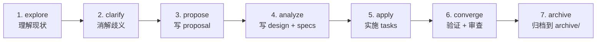

# 变更管理指南

> 本项目使用**规格驱动变更**工作流管理所有非平凡修改。统一入口,避免 openspec/ 与 specmark/ 双目录混乱。

## 统一入口

| 目录 | 用途 | 状态 |
| ---- | ---- | ---- |
| `openspec/changes/` | **主变更目录** — 所有 spec-driven 变更在此创建 | 活跃 |
| `specmark/changes/` | specmark skill 产物目录(自动路由到 openspec/) | 兼容保留 |

**规则**: 新建变更统一放在 `openspec/changes/<change-name>/`。`specmark/changes/` 仅保留历史产物,不再新建。

## 目录结构

每个变更包含以下文件:

```
openspec/changes/<change-name>/
├── .openspec.yaml      # 元数据(schema + created date)
├── proposal.md         # 动机 + 范围 + 非目标 + NEEDS CLARIFICATION
├── design.md           # 技术设计(架构决策 + 权衡)
├── tasks.md            # 任务分解(可勾选)
└── specs/
    └── <spec-name>/
        └── spec.md     # 规格文档(接口/行为约束)
```

## 七阶段工作流



| 阶段 | 产物 | 审查门禁 |
| ---- | ---- | -------- |
| explore | 现状分析(读代码 + 搜索) | — |
| clarify | NEEDS CLARIFICATION 列表 | 用户确认 |
| propose | `proposal.md` | 用户审批 scope + non-goals |
| analyze | `design.md` + `specs/*.md` | 用户审批技术方案 |
| apply | 代码修改 + `tasks.md` 勾选 | — |
| converge | diting + tiangang 审查 | 0 CRITICAL + 无 HIGH |
| archive | 移入 `archive/YYYY-MM-DD-<name>/` | — |

## 归档约定

- 归档目录: `openspec/changes/archive/YYYY-MM-DD-<change-name>/`
- 归档时机: converge 通过 + git commit 完成后
- 归档内容: 完整保留 proposal/design/tasks/specs,不删改

## 与 .gitignore 的关系

`openspec/` 和 `specmark/` 均在 `.gitignore` 中 — 变更产物为**开发期工作文档**,不入版本库。
归档后的变更如需长期追溯,由开发者手动提取到独立文档或 wiki。

## 触发方式

- 手动: `请使用 specmark 工作流` 或 `/specmark`
- 自动: 当任务涉及 proposal/design/tasks 生成时,规则 19 路由到 specmark skill
- 轻量修改(单文件/纯文案): 不走 specmark,直接修改 + commit
