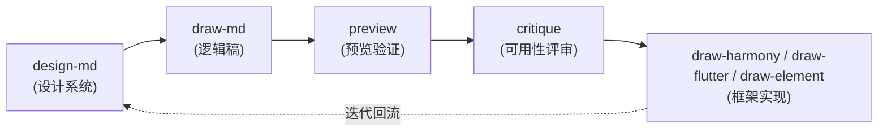

# Maliang（马良）— 前端设计生成技能

> 覆盖 UIUX 全生命周期的设计系统 skill（研究→定义→设计→实现→验证→交付→迭代）：`DESIGN.md` 设计系统 + 页面级硬 token UI markdown + 三框架代码适配，一条流水线跑通。

[](https://github.com/Kirky-X/maliang/tags) [](LICENSE) [](scripts/)

中文 | [English](README_EN.md)

## ✨ 功能特性

**11 个子命令**覆盖全生命周期（完整路由表见 [SKILL.md](SKILL.md)）：

| 子命令 | 阶段 | 功能 |
| ------ | ---- | ---- |
| `design-md` | 定义 | 创建/应用/验证/导出 prose-first 的 DESIGN.md（YAML token + 设计理由，含 persona/journey/JTBD 用户研究） |
| `redesign` | 迭代 | 改版现有 UI：9 维审计 + Refresh / Restructure / Rebuild / Deslop（去 AI 味）四模式 |
| `draw-md` | 设计 | 从 DESIGN.md 产出页面级硬 token UI markdown（颜色/字体/间距全引用 token） |
| `preview` | 验证 | Element Plus + iOS/Android 设备外壳实时预览 |
| `critique` | 验证 | Nielsen 10 启发式 0–4 评分 + persona 走查 + 认知负荷清单，产出评分快照/趋势/backlog |
| `draw-harmony` / `draw-flutter` / `draw-element` | 实现 | 转换为 HarmonyOS(ArkTS) / Flutter(Dart) / Element Plus(Vue 3) 框架代码 |
| `ui-graph` | 交付 | UI 关系图（层级 + 跳转 + 哈希基线 + 实现映射），变更追踪与实现缺口查询 |
| `ip` / `ip-handbook` | 交付 | IP 形象生成（API 优先，fallback prompt）/ IP 视觉手册（8 模块，2K 3:4） |

- **设计资产库**：12 种设计语言模板墙（液态玻璃 / M3 Expressive / Fluent 2 / Bento / 瑞士编辑 / OLED 暗色等）+ 18 篇组件命名词汇 + 八维规范（色/字/图/距/角/线/布局/海拔）
- **三框架组件文档**：56 类组件 × HarmonyOS/Flutter/Element Plus（`references/framework/`）
- **已并入资产**：原 interface-design skill 并入 [`references/interface-design/`](references/interface-design/)（产品 UI craft 纪律与严格评审/去 slop 深流程）；Vercel Web Interface Guidelines 快照在 [`references/meta/web-interface-guidelines.md`](references/meta/web-interface-guidelines.md)（sha e3d624b，2026-09-12），critique 的 UI 合规/a11y 清单读取该快照
- **脚本验证层**：`validate-draw-md.py`（13 项检查）、`preview-check.py`（49/113 项可脚本化，含 WCAG 对比度）、`ui-graph.py`（7 子命令）、`ci-gate.sh` 统一入口——纯 Python 标准库

## 📦 安装

```bash
# 方式 1：从本仓库根一键部署（同步到 ~/.zcode/skills/ 与 ~/.claude/skills/，LF 强制归一）
bash scripts/sync-skills.sh maliang

# 方式 2：手动拷贝到 agent 技能目录
cp -r maliang/ ~/.zcode/skills/maliang/
# 方式三：远程安装（GitHub 仓库）
npx skills add Kirky-X/maliang --agent claude-code -y
```

首跑依赖：仅需 Python 3.8+（脚本层全部标准库），无 requirements.txt。

## 🚀 快速开始

前置：skill 已部署到 agent 技能目录；`{SKILL_DIR}` 指安装目录，`--target` 指向用户项目路径（禁止拿 skill 自带 `examples/` 当分析目标）。

```text
为这个项目创建 DESIGN.md               # → design-md
出首页和设置页的 UI markdown            # → draw-md（需先有 DESIGN.md）
审查一下这个页面的可用性                # → critique（Nielsen 10 + persona 走查）
把这个页面转成 HarmonyOS 代码           # → draw-harmony
```

脚本层可直接独立运行：

```bash
python3 {SKILL_DIR}/scripts/ui-graph.py generate --target ui-markdown/      # 生成 UI 关系图
python3 {SKILL_DIR}/scripts/ui-graph.py check-nav --target ui-markdown/     # 导航死链检查
python3 {SKILL_DIR}/scripts/validate-draw-md.py ui-markdown/ --format text  # 13 项规范性检查
bash {SKILL_DIR}/scripts/ci-gate.sh                                          # CI 验证门（单测 + 三验证器）
```

### 全景流程（mermaid）



## ✅ 测试与验证

pytest 实测（2026-09-13，Python 3.12）：

```text
$ python3 -m pytest tests -q
........................................................................  [ 76%]
......................                                                   [100%]
94 passed in 0.07s
```

4 个测试文件（双列 fixture，"应报 + 不应报"成对覆盖）：`test_maliang_common` / `test_preview_check` / `test_ui_graph` / `test_validate_draw_md`。

CI 门实测：`bash scripts/ci-gate.sh` → `结果: PASS`（单元测试 ✓、validate-draw-md ✓、validate-framework ✓、ui-graph check-nav ✓、preview-check 0 error / 3 warning，覆盖 49/113 项，其余需浏览器人工验证）。push/PR 由 `.github/workflows/validate.yml` 自动执行同一门禁。

## 📁 目录结构

```text
maliang/
├── SKILL.md                 # 入口：11 子命令路由 + meta 加载时序 + 失败模式 + 禁止事项
├── skill.json               # 元数据（v0.3.0，MIT）
├── references/
│   ├── commands/            # 11 个子命令流程文档
│   ├── meta/                # 规范层：token / principles / ux-rules / lifecycle / accessibility …
│   │                        #   含 web-interface-guidelines.md 快照（sha e3d624b）
│   ├── interface-design/    # 原 interface-design skill 并入（craft 纪律 / 严格评审）
│   ├── dimensions/          # 八维规范 + 调色板库 + 液态玻璃配方
│   ├── framework/           # 56 类组件 × 三框架文档（harmony / flutter / element）
│   ├── templates/           # 模板墙：12 种设计语言 + 整页模式 + 落地页编排
│   ├── vocabulary/          # 18 篇组件命名词汇
│   └── default-pages/       # 默认页面清单（App/Web 各 15 页，P0–P2）
├── scripts/                 # ui-graph / validate-draw-md / preview-check / ci-gate / device_models / devices/
├── examples/                # 13 种设计系统示例 + 端到端链路产物（ui-markdown → preview → Vue）
└── tests/                   # pytest 套件（94 用例，4 文件）
```

## 🔮 边界

- **不适用**：无 UI 的后端/脚本/数据任务、纯文案写作、非视觉类代码生成
- **一次性改版**：不想沉淀 design token 的整站翻新交给 `redesign-existing-projects` skill；maliang 的 redesign 面向要回流 decisions 账本的持续改版
- **代码质量/架构审查**归 [diting](../diting/)；**安全扫描**归 [tiangang](../tiangang/)
- **流程硬约束**：无 DESIGN.md 严禁直接进入 draw-md / draw-* 下游（token 引用悬空）；禁止硬编码颜色/字号/间距，一律 `{token-name}` 占位

## 📄 License 与归属

MIT License（© 2026 Kirky-X）。`references/interface-design/` 来自已并入的原 interface-design skill；`references/meta/web-interface-guidelines.md` 为 [Vercel Web Interface Guidelines](https://github.com/vercel-labs/web-interface-guidelines) 的本地快照（sha e3d624b，钉定 2026-09-12）。
