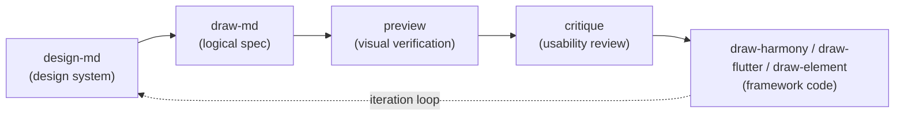

# Maliang — Frontend Design Generation Skill

> A design-system skill covering the full UIUX lifecycle (research → define → design → implement → verify → deliver → iterate): `DESIGN.md` design system + page-level hard-token UI markdown + framework code for three targets, one pipeline end to end.

[](https://github.com/Kirky-X/maliang/tags) [](LICENSE) [](scripts/)

English | [中文](README.md)

## ✨ Features

**11 subcommands** covering the full lifecycle (full routing table in [SKILL.md](SKILL.md)):

| Subcommand | Stage | Function |
| ---------- | ----- | -------- |
| `design-md` | Define | Create/apply/validate/export a prose-first DESIGN.md (YAML tokens + design rationale, with persona/journey/JTBD user research) |
| `redesign` | Iterate | Revamp existing UI: 9-dimension audit + Refresh / Restructure / Rebuild / Deslop (AI-slop removal) modes |
| `draw-md` | Design | Produce page-level hard-token UI markdown from DESIGN.md (colors/fonts/spacing all token-referenced) |
| `preview` | Verify | Live preview with Element Plus inside iOS/Android device shells |
| `critique` | Verify | Nielsen 10 heuristics scored 0–4 + persona walkthrough + cognitive-load checklist; emits score snapshots/trends/backlog |
| `draw-harmony` / `draw-flutter` / `draw-element` | Implement | Convert to HarmonyOS(ArkTS) / Flutter(Dart) / Element Plus(Vue 3) framework code |
| `ui-graph` | Deliver | UI relationship graph (hierarchy + navigation + hash baseline + implementation map), change tracking and implementation-gap queries |
| `ip` / `ip-handbook` | Deliver | IP character generation (API first, prompt fallback) / IP visual handbook (8 modules, 2K 3:4) |

- **Design asset library**: template wall with 12 design languages (liquid glass / M3 Expressive / Fluent 2 / Bento / Swiss editorial / OLED dark, etc.) + 18 component-naming vocabulary docs + eight dimension specs (color / type / icon / spacing / radius / border / layout / elevation)
- **Three-framework component docs**: 56 component classes × HarmonyOS/Flutter/Element Plus (`references/framework/`)
- **Merged assets**: the former interface-design skill now lives in [`references/interface-design/`](references/interface-design/) (product-UI craft discipline and strict review / de-slop deep process); a Vercel Web Interface Guidelines snapshot sits at [`references/meta/web-interface-guidelines.md`](references/meta/web-interface-guidelines.md) (sha e3d624b, 2026-09-12) — critique reads it for UI-compliance/a11y checklists
- **Script verification layer**: `validate-draw-md.py` (13 checks), `preview-check.py` (49/113 items scriptable, incl. WCAG contrast), `ui-graph.py` (7 subcommands), `ci-gate.sh` unified entry — pure Python standard library

## 📦 Installation

```bash
# Option 1: one-command deploy from this repository root
# (syncs to ~/.zcode/skills/ and ~/.claude/skills/, LF-normalized)
bash scripts/sync-skills.sh maliang

# Option 2: manual copy into an agent skills directory
cp -r maliang/ ~/.zcode/skills/maliang/
# Option 3: Remote install (GitHub repo)
npx skills add Kirky-X/maliang --agent claude-code -y
```

First-run requirements: Python 3.8+ only (scripts use the standard library exclusively); no requirements.txt.

## 🚀 Quick Start

Prerequisite: the skill is deployed to an agent skills directory; `{SKILL_DIR}` is the install directory and `--target` points at the user's project (never analyze the skill's own `examples/`).

```text
Create a DESIGN.md for this project          # → design-md
Produce UI markdown for home and settings    # → draw-md (requires DESIGN.md first)
Review this page's usability                 # → critique (Nielsen 10 + persona walkthrough)
Convert this page to HarmonyOS code          # → draw-harmony
```

The script layer runs standalone too:

```bash
python3 {SKILL_DIR}/scripts/ui-graph.py generate --target ui-markdown/      # build the UI relationship graph
python3 {SKILL_DIR}/scripts/ui-graph.py check-nav --target ui-markdown/     # navigation dead-link check
python3 {SKILL_DIR}/scripts/validate-draw-md.py ui-markdown/ --format text  # 13 compliance checks
bash {SKILL_DIR}/scripts/ci-gate.sh                                          # CI gate (tests + 3 validators)
```

### Pipeline Overview (mermaid)



## ✅ Tests & Verification

Measured pytest run (2026-09-13, Python 3.12):

```text
$ python3 -m pytest tests -q
........................................................................  [ 76%]
......................                                                   [100%]
94 passed in 0.07s
```

Four test files (two-column fixtures pairing "should flag" with "should not flag"): `test_maliang_common` / `test_preview_check` / `test_ui_graph` / `test_validate_draw_md`.

CI gate measured: `bash scripts/ci-gate.sh` → `Result: PASS` (unit tests ✓, validate-draw-md ✓, validate-framework ✓, ui-graph check-nav ✓, preview-check 0 errors / 3 warnings covering 49/113 items — the rest need browser-based manual verification). Push/PR runs the same gate automatically via `.github/workflows/validate.yml`.

## 📁 Directory Structure

```text
maliang/
├── SKILL.md                 # Entry: 11-subcommand router + meta load order + failure modes + prohibitions
├── skill.json               # Metadata (v0.3.0, MIT)
├── references/
│   ├── commands/            # 11 subcommand workflow docs
│   ├── meta/                # Spec layer: token / principles / ux-rules / lifecycle / accessibility …
│   │                        #   incl. web-interface-guidelines.md snapshot (sha e3d624b)
│   ├── interface-design/    # merged from the former interface-design skill (craft discipline / strict review)
│   ├── dimensions/          # eight dimension specs + palette library + liquid-glass recipes
│   ├── framework/           # 56 component classes × three frameworks (harmony / flutter / element)
│   ├── templates/           # template wall: 12 design languages + full-page patterns + landing-page orchestration
│   ├── vocabulary/          # 18 component-naming vocabulary docs
│   └── default-pages/       # default page lists (15 app + 15 web pages, P0–P2)
├── scripts/                 # ui-graph / validate-draw-md / preview-check / ci-gate / device_models / devices/
├── examples/                # 13 design-system examples + end-to-end artifacts (ui-markdown → preview → Vue)
└── tests/                   # pytest suite (94 cases, 4 files)
```

## 🔮 Boundaries

- **Not applicable**: backend/script/data tasks without UI, pure copywriting, non-visual code generation
- **One-shot revamps**: whole-site refreshes that should not accumulate design tokens belong to the `redesign-existing-projects` skill; maliang's redesign targets continuous iteration that flows back into the decisions ledger
- **Code quality/architecture review** belongs to [diting](../diting/); **security scanning** to [tiangang](../tiangang/)
- **Hard workflow constraints**: never enter draw-md / draw-* downstream without a DESIGN.md (dangling token references); hard-coded colors/fonts/spacing are forbidden — always `{token-name}` placeholders

## 📄 License & Attribution

MIT License (© 2026 Kirky-X). `references/interface-design/` comes from the merged former interface-design skill; `references/meta/web-interface-guidelines.md` is a local snapshot of the [Vercel Web Interface Guidelines](https://github.com/vercel-labs/web-interface-guidelines) (sha e3d624b, pinned 2026-09-12).
