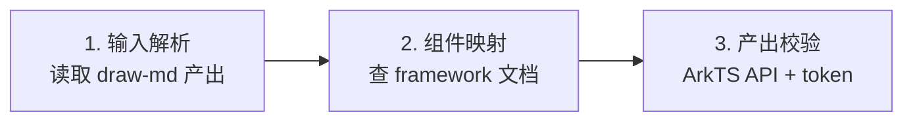

# draw-harmony 子命令 —— 将逻辑 UI 转换为 HarmonyOS(ArkTS)实现

> 本文件是 `draw-harmony` 子命令的完整流程,由顶层 [`SKILL.md`](../../SKILL.md) 路由进入。
> 输入 = `draw-md` 产出的页面级 UI markdown(`examples/ui-markdown/` 下),输出 = HarmonyOS ArkTS 框架实现代码。
> 组件映射参考 [`framework/harmony/`](../framework/harmony/) 下的组件文档。

---

## 流程概览(三段式)

---

## 1. 输入解析

读取 `draw-md` 产出的页面 markdown(位于 `examples/ui-markdown/ui/` 下):

1. **解析 frontmatter** — 提取 `name`、`description`、`background`、`updated`、`version`
2. **解析 token.md** — 读取 `examples/ui-markdown/token.md`,建立 token 名→硬值映射表(颜色/字体/间距/圆角)
3. **解析布局章节** — 按"顶部导航 → 主体区块 → 底部 dock"顺序,逐章提取组件类型(按钮/文本/列表/...)与参数表

**🔴 CHECKPOINT · 输入解析确认**:确认已解析出页面布局章节 + 组件参数表 + token 引用清单(逻辑组件 → HarmonyOS ArkTS 组件预映射),再进入组件映射阶段。

---

## 2. 组件映射

逐组件查 [`framework/harmony/`](../framework/harmony/) 文档,将逻辑组件映射为 HarmonyOS ArkTS 组件:

### 组件映射表

| 逻辑组件(draw-md) | HarmonyOS 组件 | 框架文档 |
| ------------------- | --------------- | -------- |
| button | `Button` | [component.md](../framework/harmony/button/component.md) + [usage.md](../framework/harmony/button/usage.md) |
| text | `Text` / `Span` | [component.md](../framework/harmony/text/component.md) + [usage.md](../framework/harmony/text/usage.md) |
| list | `List` + `ListItem` | [component.md](../framework/harmony/list/component.md) + [usage.md](../framework/harmony/list/usage.md) |
| image | `Image` | [component.md](../framework/harmony/image/component.md) + [usage.md](../framework/harmony/image/usage.md) |
| input | `TextInput` | [component.md](../framework/harmony/input/component.md) + [usage.md](../framework/harmony/input/usage.md) |
| navigation bar | `Navigation` | (参考 organisms/) |
| layout | `Row` / `Column` / `Stack` / `Flex` | [component.md](../framework/harmony/layout/component.md) + [usage.md](../framework/harmony/layout/usage.md) |
| tabs | `Tabs` + `TabContent` | [component.md](../framework/harmony/tabs/component.md) + [usage.md](../framework/harmony/tabs/usage.md) |
| form | N/A(ArkTS 无 Form 容器,用 `Column` + 校验组合) | [N/A](../framework/harmony/form/component.md) |
| dialog | `AlertDialog` / `CustomDialog` | [component.md](../framework/harmony/dialog/component.md) + [usage.md](../framework/harmony/dialog/usage.md) |
| grid | `GridRow` + `GridCol` / `GridContainer` | [component.md](../framework/harmony/grid/component.md) + [usage.md](../framework/harmony/grid/usage.md) |
| progress | `Progress` | [component.md](../framework/harmony/progress/component.md) + [usage.md](../framework/harmony/progress/usage.md) |
| icon | `Image`(SVG)/ `SymbolGlyph` | [component.md](../framework/harmony/icon/component.md) + [usage.md](../framework/harmony/icon/usage.md) |
| shape | `Shape` / 自定义 `Path`(矢量) | [component.md](../framework/harmony/shape/component.md) + [usage.md](../framework/harmony/shape/usage.md) |
| theme | `ColorMode` + `AppStorage`(浅/暗) | [component.md](../framework/harmony/theme/component.md) + [usage.md](../framework/harmony/theme/usage.md) |
| animation | `animateTo` + `animation` 属性 / `Transition` | [component.md](../framework/harmony/animation/component.md) + [usage.md](../framework/harmony/animation/usage.md) |
| gesture | `TapGesture` / `PanGesture` / `LongPressGesture` | [component.md](../framework/harmony/gesture/component.md) + [usage.md](../framework/harmony/gesture/usage.md) |
| i18n | `$r()` 资源 + `Intl` API | [component.md](../framework/harmony/i18n/component.md) + [usage.md](../framework/harmony/i18n/usage.md) |
| a11y | `accessibilityText` / `accessibilityDescription` 属性 | [component.md](../framework/harmony/a11y/component.md) + [usage.md](../framework/harmony/a11y/usage.md) |
| video | `Video` / `XComponent` | [component.md](../framework/harmony/video/component.md) + [usage.md](../framework/harmony/video/usage.md) |
| menu | `Menu` + `MenuItem` | [component.md](../framework/harmony/menu/component.md) + [usage.md](../framework/harmony/menu/usage.md) |
| scroll | N/A(ArkTS 用 `Scroll` 容器,无独立指南) | [N/A](../framework/harmony/scroll/component.md) |
| carousel | `Swiper` | [component.md](../framework/harmony/carousel/component.md) + [usage.md](../framework/harmony/carousel/usage.md) |
| radio | `Radio` + `RadioGroup` | [component.md](../framework/harmony/radio/component.md) + [usage.md](../framework/harmony/radio/usage.md) |
| switch | `Toggle` | [component.md](../framework/harmony/switch/component.md) + [usage.md](../framework/harmony/switch/usage.md) |
| popover | `Popup` / `bindPopup` | [component.md](../framework/harmony/popover/component.md) + [usage.md](../framework/harmony/popover/usage.md) |
| message | `promptAction.showToast` | [component.md](../framework/harmony/message/component.md) + [usage.md](../framework/harmony/message/usage.md) |
| drawer | `bindSheet` | [component.md](../framework/harmony/drawer/component.md) + [usage.md](../framework/harmony/drawer/usage.md) |
| checkbox | `Checkbox` + `CheckboxGroup` | [component.md](../framework/harmony/checkbox/component.md) + [usage.md](../framework/harmony/checkbox/usage.md) |
| select | `Select`(数据录入;动作菜单见 menu) | [component.md](../framework/harmony/select/component.md) + [usage.md](../framework/harmony/select/usage.md) |
| upload | 组合方案(PhotoViewPicker/DocumentViewPicker + List + Progress) | [component.md](../framework/harmony/upload/component.md) + [usage.md](../framework/harmony/upload/usage.md) |
| date-picker | `DatePickerDialog` / `TimePickerDialog`(录入;浏览见 calendar) | [component.md](../framework/harmony/date-picker/component.md) + [usage.md](../framework/harmony/date-picker/usage.md) |
| notification | 组合方案(Stack 顶部横幅,常驻可操作) | [component.md](../framework/harmony/notification/component.md) + [usage.md](../framework/harmony/notification/usage.md) |
| slider | `Slider` | [component.md](../framework/harmony/slider/component.md) + [usage.md](../framework/harmony/slider/usage.md) |
| segmented | `SegmentButton`(`@ohos.arkui.advanced`) | [component.md](../framework/harmony/segmented/component.md) + [usage.md](../framework/harmony/segmented/usage.md) |
| rate | `Rating` | [component.md](../framework/harmony/rate/component.md) + [usage.md](../framework/harmony/rate/usage.md) |
| popconfirm | 组合方案(bindPopup 自定义气泡 / AlertDialog 轻确认) | [component.md](../framework/harmony/popconfirm/component.md) + [usage.md](../framework/harmony/popconfirm/usage.md) |
| fab | 组合方案(Stack + 圆形 Button,滚动联动) | [component.md](../framework/harmony/fab/component.md) + [usage.md](../framework/harmony/fab/usage.md) |
| statistic | 组合方案(Text 组合:数值 + 标签 + delta / 键值对 Row) | [component.md](../framework/harmony/statistic/component.md) + [usage.md](../framework/harmony/statistic/usage.md) |
| card | 组合方案(`Column` + 圆角/阴影装饰属性) | [component.md](../framework/harmony/card/component.md) + [usage.md](../framework/harmony/card/usage.md) |
| table | 组合方案(`Grid` / `List` 组合) | [component.md](../framework/harmony/table/component.md) + [usage.md](../framework/harmony/table/usage.md) |
| tag | 组合方案(`Text` + 背景色圆角 / `Badge`) | [component.md](../framework/harmony/tag/component.md) + [usage.md](../framework/harmony/tag/usage.md) |
| avatar | 组合方案(`Image` + `borderRadius(radius-full)` 裁剪) | [component.md](../framework/harmony/avatar/component.md) + [usage.md](../framework/harmony/avatar/usage.md) |
| badge | `Badge` | [component.md](../framework/harmony/badge/component.md) + [usage.md](../framework/harmony/badge/usage.md) |
| pagination | 组合方案(`Row` + `Button` 页码组) | [component.md](../framework/harmony/pagination/component.md) + [usage.md](../framework/harmony/pagination/usage.md) |
| steps | 组合方案(`Row` + `Icon`/圆点 + 连接线) | [component.md](../framework/harmony/steps/component.md) + [usage.md](../framework/harmony/steps/usage.md) |
| divider | `Divider` | [component.md](../framework/harmony/divider/component.md) + [usage.md](../framework/harmony/divider/usage.md) |
| calendar | `Calendar` / `CalendarPicker`(展示;录入见 date-picker) | [component.md](../framework/harmony/calendar/component.md) + [usage.md](../framework/harmony/calendar/usage.md) |
| collapse | 组合方案(`List` + `if` 条件渲染 + 展开状态) | [component.md](../framework/harmony/collapse/component.md) + [usage.md](../framework/harmony/collapse/usage.md) |
| skeleton | 组合方案(占位块 + 闪烁动画) | [component.md](../framework/harmony/skeleton/component.md) + [usage.md](../framework/harmony/skeleton/usage.md) |
| breadcrumb | 组合方案(`Row` + `Text` + `SymbolGlyph` 分隔符) | [component.md](../framework/harmony/breadcrumb/component.md) + [usage.md](../framework/harmony/breadcrumb/usage.md) |
| timeline | 组合方案(`List` + 竖线 + 节点圆点) | [component.md](../framework/harmony/timeline/component.md) + [usage.md](../framework/harmony/timeline/usage.md) |
| tree | 组合方案(`List` + 递归 `@Builder` + 缩进) | [component.md](../framework/harmony/tree/component.md) + [usage.md](../framework/harmony/tree/usage.md) |
| alert | `AlertDialog` / `promptAction.showDialog` | [component.md](../framework/harmony/alert/component.md) + [usage.md](../framework/harmony/alert/usage.md) |
| dropdown | 组合方案(`Button` + `bindMenu`/`Menu`) | [component.md](../framework/harmony/dropdown/component.md) + [usage.md](../framework/harmony/dropdown/usage.md) |
| loading | `LoadingProgress` | [component.md](../framework/harmony/loading/component.md) + [usage.md](../framework/harmony/loading/usage.md) |

### Token 映射规则

| draw-md token 引用 | HarmonyOS 实现 |
| ------------------- | --------------- |
| `{color-primary}` | `$r('app.color.primary')` 资源引用,或 `.backgroundColor(Color(0xFF...))` |
| `{font-size-md}` | `.fontSize($r('app.float.font_size_md'))` 或 `.fontSize(16)` |
| `{spacing-md}` | `.padding($r('app.float.spacing_md'))` 或 `.padding(16)` |
| `{radius-md}` | `.borderRadius($r('app.float.radius_md'))` 或 `.borderRadius(8)` |

> 优先使用资源引用(`$r()`),若无资源系统则降级为硬值(从 token.md 解析)。

### 映射步骤

1. 识别组件类型 — 从参数表的组件名推断(如"按钮"→Button)
2. 查框架文档 — 读 `framework/harmony/<component>/component.md` 获取 API,读 `usage.md` 获取用法示例
3. 填充属性 — 将 draw-md 参数表的值(token 引用)映射为 ArkTS 属性调用
4. 生成代码 — 产出 `@Component` struct,含 `build()` 方法

**🔴 CHECKPOINT · ArkTS 代码生成确认**:确认每个组件都已映射到 ArkTS 原生组件,所有 token 引用点已用 `{token-name}` 格式标注(无裸值),再进入产出校验。

---

## 3. 产出校验

生成 ArkTS 代码后,执行自检:

- [ ] 所有组件使用正确的 ArkTS 装饰器(`@Component` / `@Entry` / `@Builder`)
- [ ] 颜色值已从 token 映射为资源引用或硬值,无 `{token-name}` 占位符残留
- [ ] 布局结构符合 draw-md 章节顺序(顶部导航 → 主体 → 底部 dock)
- [ ] 组件属性与 `framework/harmony/` 文档一致(无杜撰 API)
- [ ] 产出文件含注释标注来源(`// 由 draw-harmony 从 <page>.md 生成`)

**🔴 CHECKPOINT · 校验通过确认**:确认无裸值、无悬空 token、组件映射完整,ArkTS 代码方可交付使用。

---

## 产出物

- 一个页面 → 一个 ArkTS 文件(`@Entry @Component struct <PageName>`)
- 跨页面复用组件 → 单独 struct 文件(被各页面 `@Entry` 引用)
- 文件命名:`<page-name>.ets`(如 `home.ets`、`setting_about.ets`)

---

## 约束汇总(硬性)

- [ ] 输入必须是 draw-md 产出(含 frontmatter + 参数表 + token 引用),MUST NOT 直接从 DESIGN.md 跳过 draw-md
- [ ] 组件映射 MUST 查 `framework/harmony/` 文档,MUST NOT 凭记忆杜撰 ArkTS API
- [ ] Token 引用 MUST 解析为具体值(资源引用或硬值),MUST NOT 在产出代码中残留 `{token-name}` 占位符
- [ ] 产出代码 MUST 可在 DevEco Studio 中编译(语法正确、import 完整)

---

## 失败模式与 fallback

| 触发条件 | 一线修复 | 仍失败兜底 |
| -------- | -------- | ---------- |
| DESIGN.md 缺失关键 token(如无 color.text) | 列出缺失 token 清单,询问用户补全 | 用 `{color-text-primary}` 等标准命名占位,标注"假设值,需 DESIGN.md 确认" |
| UI markdown 缺少 token 引用(裸值) | 提示具体偏差(哪些值未引用 token) | 用 DESIGN.md 中的 token 替换裸值,标注"自动补全,需确认" |
| 组件无对应 ArkTS 组件文档(framework/harmony/ 无对应类型) | 在 index.md 索引表查最接近类型 | 用基础组件(Button/Text/List)组合实现,标注"组合方案" |
| ArkTS 代码编译报错(@Component 装饰器/状态管理错误) | 提示具体编译错误及修复方向 | 引导用户简化 UI markdown(移除复杂组件)后重试 |

---

## 禁止事项(反例)

- **禁止把 draw-md 的逻辑 UI markdown 直接复制粘贴为 ArkTS 代码**:逻辑 UI 是设计意图(参数表 + token 引用),不是可运行代码,直接粘贴会缺装饰器与状态管理。MUST 按本文件组件映射表逐组件转换为 `@Component` struct。
- **禁止在 ArkTS 中硬编码颜色字面量**(如 `Color(0xFF5B7CFA)`):字面量脱离 token 体系,主题切换与多端一致失效。MUST 引用 `@Styles` / `@Extend` 定义的设计 token 资源(`$r('app.color.primary')`)。
- **禁止用 `Flex` 容器代替 `Row` / `Column`**:`Flex` 性能差且语义弱(需计算弹性权重),线性布局不应使用。MUST 用 `Row` / `Column` 表达横向/纵向线性布局。
- **禁止列表用 `ForEach` 不加 `key`**:缺 key 会导致 diff 全量比对、重渲染抖动与状态错位。MUST 为 `ForEach` 提供稳定 `keyGenerator`。
- **禁止导航用 `router.pushUrl` 不处理回调失败**:跳转失败(页面不存在/栈溢出)会被静默吞掉,用户无反馈。MUST 处理 `err` 回调并提示用户。
