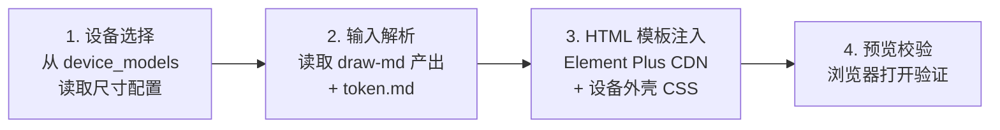

# preview 子命令 —— 使用 Element Plus 实时预览验证

> 本文件是 `preview` 子命令的完整流程,由顶层 [`SKILL.md`](../../SKILL.md) 路由进入。
> 输入 = `draw-md` 产出的页面级 UI markdown(`examples/ui-markdown/` 下),输出 = 自包含 HTML 预览文件。
> 预览使用 Element Plus 框架(CDN 引入),支持设备外壳展示(从 `scripts/device_models.py` 读取尺寸)。

---

## 流程概览



---

## 1. 设备选择

从 [`scripts/device_models.py`](../../scripts/device_models.py) 读取设备尺寸配置,让用户选择预览设备(设备清单见该脚本,流程文档不重复列出,避免与脚本脱节)。

**🔴 CHECKPOINT · 设备选择**:展示设备列表,让用户选择预览设备。默认选 iPhone 15(393×852)。

---

## 2. 输入解析

读取 `draw-md` 产出的页面 markdown:

1. **解析 frontmatter** — 提取 `name`、`description`、`background`、`updated`、`version`
2. **解析 token.md** — 读取 `examples/ui-markdown/token.md`,建立 token 名→硬值映射表
3. **解析布局章节** — 按"顶部导航 → 主体区块 → 底部 dock"顺序,逐章提取组件类型与参数表
4. **解析 organisms** — 若页面引用了 `organisms/` 下的组件,读取对应 markdown

**🔴 CHECKPOINT · 输入解析确认**:确认 UI markdown + token.md 已读取,设备尺寸已从 device_models.py 选定,展示预览配置摘要(页面名 + 设备名 + 尺寸)供用户确认,再进入 HTML 生成。

---

## 3. HTML 模板注入

将解析结果注入 HTML 模板,生成自包含预览文件:

```html
<!-- SRI 提示:integrity 哈希随 CDN 资源版本变化。当前哈希对应 element-plus@2.4.4 与 vue@3.4.21;更新版本时必须用 `openssl dgst -sha384 -binary <file> | openssl base64 -A` 重新生成并替换 integrity 属性值,否则浏览器会因 SRI 不匹配拒绝加载资源导致预览无法渲染。 -->
<!DOCTYPE html>
<html lang="zh-CN">
<head>
  <meta charset="UTF-8">
  <title>预览 - <页面名称></title>
  <link rel="stylesheet" href="https://unpkg.com/element-plus@2.4.4/dist/index.css"
        integrity="sha384-kkb0OalbI4Ig9NU9d8J+OvUzucgmMGl8jmxwJ2nEw/vqiyQbd0rplhuU5TfnNNYp"
        crossorigin="anonymous">
  <script src="https://unpkg.com/vue@3.4.21/dist/vue.global.js"
          integrity="sha384-8CdW77YPqMZ3v22pThUIR22Qp1FB5oisZG2WE3OpE0l1fTHAIsdIwjQZFf/rmQ/B"
          crossorigin="anonymous"></script>
  <script src="https://unpkg.com/element-plus@2.4.4/dist/index.full.min.js"
          integrity="sha384-BN4M9h5H6vfLYw9pv5Lgjk5VHdDVkm1zzsgkZ1DhGfWie/dDmCsQDVCA728TX0ry"
          crossorigin="anonymous"></script>
  <style>
    :root { /* CSS 变量注入(从 token.md 解析) */
      --color-primary: #...;  --color-surface: #...;
      --font-size-md: 16px;  --spacing-md: 16px;  --radius-md: 8px;
    }
    .device-shell { width: <设备宽度>px; height: <设备高度>px; /* 设备外壳样式 */ }
  </style>
</head>
<body>
  <div id="app">
    <div class="device-shell">
      <div class="device-screen">
        <el-container>
          <el-header><!-- 顶部导航 --></el-header>
          <el-main><!-- 主体区块 --></el-main>
          <el-footer><!-- 底部 dock --></el-footer>
        </el-container>
      </div>
    </div>
  </div>
  <script>
    const { createApp } = Vue;
    const app = createApp({ /* 页面数据与方法 */ });
    app.use(ElementPlus);
    app.mount('#app');
  </script>
</body>
</html>
```

### 设备外壳 CSS

根据设备类型(phone / tablet)选择不同的外壳模板。两者共享 `--el-device-*` CSS 变量命名空间(对齐 Element Plus `--el-*` 规范),采用钛金属渐变边框 + 多层阴影模拟真实设备外观:

- **手机**(phone,iPhone 15 风格):钛金属 5-stop 渐变边框 + Dynamic Island(126×37px 胶囊) + 真实按键布局(静音键/音量上下/电源键) + Home Indicator(134×5px) + 6 层阴影,参考 [`scripts/devices/phone.html`](../../scripts/devices/phone.html)
- **平板**(tablet,iPad Pro 风格):钛金属渐变边框(更薄 7px) + 前置摄像头圆点(带镜头反光) + 音量上下 + 电源键 + 四扬声器栅格 + 6 层阴影 + 动态 scale transform,参考 [`scripts/devices/tablet.html`](../../scripts/devices/tablet.html)

**`--el-device-*` 变量命名空间**(preview 子命令注入 token 时优先映射):

| 变量类别 | 示例变量 | 用途 |
| -------- | -------- | ---- |
| 钛金属色板 | `--el-device-titanium-light/mid/dark` | 边框渐变 5-stop |
| 边框/屏幕 | `--el-device-bezel` / `--el-device-screen-bg` | 黑边过渡 + 屏幕底色 |
| 装饰元素 | `--el-device-notch-bg` / `--el-device-camera-bg` / `--el-device-speaker-bg` | Dynamic Island / 摄像头 / 扬声器 |
| 按键 | `--el-device-button-bg` | 侧边按键渐变 |
| 阴影 | `--el-device-shadow-ambient/key/inner` | 6 层阴影分层 |

### 组件映射规则

| draw-md 逻辑组件 | Element Plus 预览组件 |
| ------------------- | --------------------- |
| button | `<el-button>` |
| text | `<el-text>` / `<p>` / `<h1>`~`<h6>` |
| list | `<el-table>` 或 `<div v-for>` |
| navigation bar | `<el-menu>` / `<el-header>` |
| dock | `<el-footer>` + `<el-button-group>` |

**🔴 CHECKPOINT · HTML 生成确认**:确认 preview HTML 已生成且 token 引用正确(无硬编码颜色/字号/间距),设备外壳 CSS 已注入,提示用户在浏览器打开验证效果。

---

## 4. 预览校验

生成 HTML 文件后,执行校验:

- [ ] HTML 文件自包含(无本地依赖,CDN 资源可访问)
- [ ] CSS 变量已从 token.md 注入到 `:root`,无 `{token-name}` 占位符残留
- [ ] 设备外壳尺寸与所选设备一致(宽×高)
- [ ] 页面内容按 draw-md 章节顺序排列(顶部导航 → 主体 → 底部 dock)
- [ ] Element Plus 组件正确渲染(无 Vue 控制台错误)
- [ ] 在浏览器中打开文件,视觉与 draw-md 描述一致

### 校验强化

preview 产出的 HTML 必须通过 `validate-draw-md.py` 全部 12 项检查(含 5 项新检查:暗色/aria/触控区/动效/radius),不通过则回退 draw-md 修补。

**aria-label 在 HTML 的映射规则:**
- button → `<el-button aria-label="语义描述">`
- icon → `<el-icon aria-label="语义描述">`
- input → `<el-input aria-label="语义描述">`
- link → `<a aria-label="语义描述">`

**暗色模式在 HTML 的映射:**
- 用 CSS 变量 + `prefers-color-scheme: dark` 媒体查询
- `{surface-dark}` → `--surface-dark: #1A1B1E;`

---

## 5. Pre-Flight Check(102 项机械检查)

> 交付前**机械扫描**(可脚本化,非主观判断)。任一项失败即"硬性失败",不可交付,必须返工。来源:taste-skill + ui-ux-pro-max-skill。

**完整 102 项检查清单见 [`preview-checklist.md`](./preview-checklist.md)**(从本文件拆出以控制行数),按 13 个维度分组:

| 分组       | 项数 | 覆盖范围                                                  |
| ---------- | ---- | --------------------------------------------------------- |
| 5.1 AI Tells | 15   | 渐变/圆角/字族/容器宽度/定价/Lucide 等通用 AI 味         |
| 5.2 Performance | 10   | 图片尺寸/字体/动画属性/z-index/JS 体积/虚拟滚动           |
| 5.3 WCAG 对比度 | 8    | 正文/大文本/UI 组件/placeholder/暗色模式/色盲             |
| 5.4 用户偏好 | 6    | reduced-motion/reduced-transparency/双跑预览              |
| 5.5 交互可达 | 8    | Tab/focus ring/触摸目标/alt/aria-label/Skip 链接          |
| 5.6 Token 完整性 | 10   | CSS 变量/硬编码/三层引用/kebab-case                       |
| 5.7 完整交互状态 | 8    | 五态/Loading/Empty/Error/Tactile/toast                    |
| 5.8 LLM 截断信号 | 8    | 章节字数/代码块完整/placeholder/文案具体性                |
| 5.9 动画动机 | 7    | 动机可答/装饰循环/duration/stagger/translateY/缓动        |
| 5.10 排版细节 | 6    | **em-dash 中文场景**/eyebrow 计数/标题字数/中英空格/标点  |
| 5.11 视觉一致性锁 | 5    | **主题锁/色彩锁/形状锁**/阴影档位/字号档位                |
| 5.12 Hero 适配 | 6    | 移动端/桌面端 Hero/100svh/srcset/poster/CTA 数            |
| 5.13 Core Web Vitals | 5    | **LCP/CLS/INP/FCP/TBT** 阈值                              |

### 执行规则
- 102 项均为**机械检查**(可脚本化),任一项失败 = 硬性失败(不可降级为 warning),失败项必须列出具体位置(HTML 行号 / CSS 选择器)
- 修复后重跑全部 102 项(不可只跑失败项),通过后进入第 6 节 Pre-Delivery Checklist(主观维度)
- em-dash / 中英文空格 / 标点一致性为**软警告**(warning),其余 99 项为硬性失败

---

## 6. Pre-Delivery Checklist(5 维交付前检查)

> Pre-Flight Check 通过后的人工主观检查。5 个维度,每维度 1-5 分,任一维度 < 3 分不交付。来源:taste-skill。

### 维度 1 · Completeness(完整性)
- 设计是否覆盖所有页面章节?
- 组件是否覆盖 default + 状态变体?
- DESIGN.md 引用的 token 是否全部出现在产物中?
- 是否有"待补全"占位?

### 维度 2 · Correctness(正确性)
- 颜色对比度是否真的达标(不仅 Pre-Flight 项通过,实际场景也合理)?
- 间距是否符合 8px 网格(或 DESIGN.md 声明的 base)?
- 字体是否正确加载(无 fallback 到 system-ui)?
- 交互逻辑是否无矛盾(如 disabled 按钮可点击)?

### 维度 3 · Consistency(一致性)
- 跨页面间距 / 圆角 / 字号档位是否一致?
- 同类组件(如多个卡片)样式是否统一?
- 暗色模式与亮色模式视觉是否对应?
- 文案语气是否一致(同一称呼 / 同一术语)?

### 维度 4 · Brand Fit(品牌契合)
- 是否避免了 AI Tells 的"通用感"?
- 是否符合 [`product-reasoning.md`](../meta/product-reasoning.md) 推理的产品类型?
- 是否参考了 [`design-systems.md`](../dimensions/design-systems.md) 中的 1-2 个锚点?
- 视觉是否与品牌色 / 品牌字体一致?

### 维度 5 · Polish(完成度)
- 微动效是否丝滑(无闪烁 / 无跳帧)?
- 边界场景(空数据 / 长文本 / 错误)是否处理?
- 移动端布局是否真的可用(非仅"响应式")?
- 视觉细节(对齐 / 字距 / 阴影)是否到位?

### 评分规则
5=优秀参考案例 / 4=良好可交付 / 3=及格有可见问题 / 2=不及格需返工 / 1=严重不及格需重新设计

**交付阈值**:5 维度全部 ≥ 3 分,且总分 ≥ 15 分。低于阈值不可交付,需返回 draw-md 修改。

**🔴 CHECKPOINT · 交付确认**:展示 5 维评分 + 总分,与用户确认后交付。低于阈值时明确说明"不可交付,需修复以下维度:[列表]"。

---

## 产出物
- 一个页面 → 一个 HTML 预览文件
- 文件命名:`preview_<page-name>_<device>.html`(如 `preview_home_iphone15.html`)
- 产出位置:用户指定目录(默认 `examples/preview/`)

---

## 约束汇总(硬性)

- [ ] 产出 HTML MUST 为自包含文件(CDN 引入 Element Plus,无本地构建依赖)
- [ ] 设备尺寸 MUST 从 `scripts/device_models.py` 读取,MUST NOT 硬编码在流程文档中
- [ ] 设备外壳 MUST 用纯 CSS 绘制(圆角 + 刘海 + 边框),MUST NOT 依赖图片资源
- [ ] Token 引用 MUST 解析为 CSS 变量值,MUST NOT 在产出 HTML 中残留 `{token-name}` 占位符
- [ ] 预览文件 MUST 可直接用浏览器打开(file:// 协议),MUST NOT 需要本地服务器
- [ ] 禁止用浏览器开发者工具手动改样式代替预览验证(无法复现、不入产物)
- [ ] 禁止跳过 iOS/Android 双端验证(单端通过不代表另一端布局/字体一致)
- [ ] 禁止预览问题只口头记录不写入修复清单(MUST 输出到下一轮 `draw-md` 的输入)
- [ ] 禁止用模拟器截图代替真机预览(关键页面 MUST 真机验证,模拟器仅用于布局快速校验)

---

## 失败模式与 fallback

| 触发条件 | 处理方式(一线修复 → 仍失败兜底) |
| -------- | ---------------------------------------- |
| 设备尺寸不在 scripts/device_models.py | 提示用户从已支持设备选最接近的 → 用最接近尺寸替代,标注"近似尺寸" |
| Element Plus CDN 不可达(离线) | 提示检查网络 → 引导用户下载 Element Plus 本地引用 |
| file:// 协议下 CDN 被阻断(混合内容策略) | 提示改用 http(s):// 或本地服务器 → 或下载 CDN 资源到本地引用(注:与"file:// 可打开"约束存在权衡,需用户选择) |
| UI markdown 缺少 token 引用(裸值) | 提示具体偏差(哪些值未引用 token) → 用 DESIGN.md token 替换,标注"自动补全,需确认" |
| preview HTML 浏览器渲染异常 | 提示检查控制台错误 → 引导用户简化 UI markdown(移除复杂组件)后重试 |
