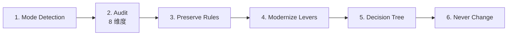
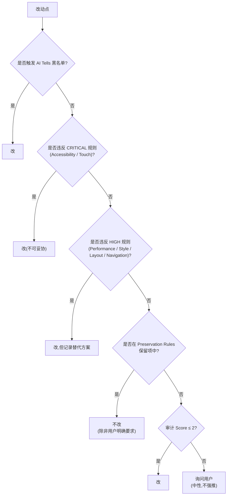

# redesign 子命令 —— Redesign Protocol

> 本文件是 `redesign` 子命令的完整流程,由顶层 [`SKILL.md`](../../SKILL.md) 路由进入。
> 输入 = 现有 UI 截图 / 代码 / URL,输出 = 改版后的 UI markdown + 改动清单(改动什么 + 为什么 + 风险)。
> 来源:taste-skill。`redesign` 是与 `design-md` 并列的"上游"子命令,但目标不是从零创建,而是**改造现有**。

## 何时触发 redesign

- 用户说"重做这个页面 / 改版 / modernize / refresh / 重新设计"
- 用户提供现有截图 + "改得更好看"诉求
- 用户说"现在的设计过时了"

> 不触发:用户只是要"加个按钮 / 改个颜色"等小改动 → 走 [`design-md.md`](./design-md.md) Phase 2 应用 token。

---

## 流程总览

---

## 1. Mode Detection(模式识别)

redesign 有三种模式,先识别再走不同路径:

| 模式          | 触发条件                                       | 改动范围             |
| ------------- | ---------------------------------------------- | -------------------- |
| Refresh       | "让它现代一点 / 但保留风格"                    | 视觉细节(色 / 字 / 间距) |
| Restructure   | "重新组织布局 / 信息架构变了"                  | 布局 + 视觉          |
| Rebuild       | "完全重做 / 品牌换了"                          | 从 DESIGN.md 重新走  |

**🔴 CHECKPOINT · 模式确认**:从用户语句判断模式,与用户确认:"识别为 [Refresh / Restructure / Rebuild],改动范围 [X],对吗?"——不确认不继续。

- Rebuild 模式直接路由到 [`design-md.md`](./design-md.md),不走 redesign 后续步骤
- Refresh 与 Restructure 继续走第 2 步

---

## 2. Audit Before Touching(8 维度审计)

**强制**。改版前必须完成 8 维度审计,**禁止"直接动手改"**。审计结果以表格形式呈现给用户。

### 维度 1 · Typography(排版)

- [ ] 字体族:display / UI / mono 分工是否清晰?
- [ ] 字号档位:是否 ≤ 5 档?
- [ ] 行高:body ≥ 1.5?
- [ ] 字重对比:headline vs body 字重差 ≥ 200?
- [ ] 字距:display 是否收紧(-0.02em)?
- [ ] 触发 [`ai-tells.md`](../meta/ai-tells.md) 第 2 节任一 Tell?
- **审计输出**:Typography Score 1-5 + 具体问题清单

### 维度 2 · Color(色彩)

- [ ] 60-30-10 比例是否成立?
- [ ] 中性色梯度是否成体系(50-900)?
- [ ] 强调色是否单一(≤ 2 个色相)?
- [ ] 暗色模式是否独立设计(非简单反色)?
- [ ] WCAG AA 对比度全部达标?(见 [`accessibility.md`](../meta/accessibility.md))
- [ ] 触发 [`ai-tells.md`](../meta/ai-tells.md) Lila Rule / Premium Palette Ban?
- **审计输出**:Color Score 1-5 + 具体问题清单

### 维度 3 · Layout(布局)

- [ ] 网格是否一致(8 列或 12 列,跨页不漂移)?
- [ ] 容器宽度是否差异化(hero / body / feature 不同 max-w)?
- [ ] 间距节奏是否有变化(非全程 py-20)?
- [ ] 触发 [`ai-tells.md`](../meta/ai-tells.md) 第 3 节 Layout Tells?
- [ ] 触发 [`ai-tells.md`](../meta/ai-tells.md) 第 9 节三列卡片禁令?
- **审计输出**:Layout Score 1-5 + 具体问题清单

### 维度 4 · Interactivity(交互)

- [ ] 所有交互元素是否有 hover/pressed/focused/disabled 四态?
- [ ] 动画是否有动机(见 [`principles.md`](../meta/principles.md) 第 13 定律)?
- [ ] MOTION_INTENSITY 档位(见 [`dials.md`](../meta/dials.md))是否合适?
- [ ] `prefers-reduced-motion` 降级是否实现?
- [ ] 触摸目标 ≥ 44pt?
- **审计输出**:Interactivity Score 1-5 + 具体问题清单

### 维度 5 · Content(内容)

- [ ] 文案是否具体(无 lorem / 无空泛词)?
- [ ] 数字是否真实风(无 100/1k 整数凑数)?
- [ ] CTA 是否明确(动词 + 名词,如"开始免费试用")?
- [ ] 信息层级是否清晰(h1 → h2 → h3 不跳级)?
- **审计输出**:Content Score 1-5 + 具体问题清单

### 维度 6 · Component Patterns(组件模式)

- [ ] 按钮是否有层级(primary / secondary / tertiary)?
- [ ] 卡片是否统一(无零散变体)?
- [ ] 表单是否有标签 + 错误反馈?
- [ ] 列表是否分页 / 虚拟滚动?
- [ ] 是否触发 [`ai-tells.md`](../meta/ai-tells.md) 第 4 节 Content Tells?
- **审计输出**:Component Score 1-5 + 具体问题清单

### 维度 7 · Iconography(图标)

- [ ] 图标集是否统一(不混用 lucide + heroicons + phosphor)?
- [ ] 风格是否一致(线性 / 填充 / 双色)?
- [ ] 线宽是否统一(1.5px / 2px)?
- [ ] 触发 [`ai-tells.md`](../meta/ai-tells.md) 第 5 节 External Resources Tells?
- **审计输出**:Iconography Score 1-5 + 具体问题清单

### 维度 8 · Code Quality(代码质量)

- [ ] 是否硬编码颜色 / 字号 / 间距(违反 token 体系)?
- [ ] CSS 是否符合 [`performance.md`](../meta/performance.md) Hardware Accel(只动 transform/opacity)?
- [ ] z-index 是否 token 化(无魔法值)?
- [ ] grain/noise 是否用伪元素(非 body 背景)?
- [ ] 是否有 prefers-reduced-motion / prefers-color-scheme / prefers-reduced-transparency 降级?
- **审计输出**:Code Score 1-5 + 具体问题清单

### 审计汇总表

| 维度            | Score | 主要问题           | 改动优先级        |
| --------------- | ----- | ------------------- | ----------------- |
| Typography      | x/5   | ...                 | High/Medium/Low   |
| Color           | x/5   | ...                 | High/Medium/Low   |
| Layout          | x/5   | ...                 | High/Medium/Low   |
| Interactivity   | x/5   | ...                 | High/Medium/Low   |
| Content         | x/5   | ...                 | High/Medium/Low   |
| Component       | x/5   | ...                 | High/Medium/Low   |
| Iconography     | x/5   | ...                 | High/Medium/Low   |
| Code Quality    | x/5   | ...                 | High/Medium/Low   |

**🔴 CHECKPOINT · 审计确认**:展示汇总表,让用户确认 Top 3 改动优先级,再进入第 3 步。

---

## 3. Preservation Rules(保留规则)

改版不是推倒重来。**必须保留**以下内容(除非用户明确要求改):

| 保留项                | 识别方式                                  | 例外                              |
| --------------------- | ----------------------------------------- | --------------------------------- |
| 品牌色相              | 从 logo / 现有 primary 提取主色相         | 用户明确"换品牌色"               |
| 信息架构              | 现有页面层级 + 导航结构                   | Restructure 模式                  |
| 业务术语              | 现有文案中的产品名 / 功能名 / 用户角色名  | 用户明确"重新命名"               |
| 核心组件库            | 现有 button / input / card 命名           | 用户明确"组件库重做"             |
| 关键转化路径          | 现有 CTA 流程(如"加购 → 结算 → 支付")   | 用户明确"转化路径重设计"         |
| 无障碍已达标的项      | 现有 WCAG AAA 项不可降级到 AA             | —                                 |
| 数据展示字段          | 现有表格列 / 图表维度                     | 用户明确"数据结构变"             |

**强制规则**:每条改动必须先回答"为什么改"和"保留什么",再动手。在最终交付清单中,"保留项"与"改动项"分开列出。

---

## 4. Modernisation Levers(现代化杠杆)

当审计完成 + 保留项识别后,从以下 8 个杠杆中选择合适的施加改动。**禁止全部应用**,按改动优先级选 2-4 个。

| 杠杆                  | 改动内容                                          | 见效快 | 风险 |
| --------------------- | ------------------------------------------------- | ------ | ---- |
| Spacing System        | 引入 8px base + token 化                          | ✓      | 低   |
| Type Scale            | 引入 modular scale(1.2 / 1.25 / 1.333)          | ✓      | 低   |
| Color Tokens          | 中性梯度 + 60-30-10 + 单一强调色                  | ✓      | 中   |
| Component States      | 补全 hover/pressed/focused/disabled 四态          | ✓      | 低   |
| Motion Layer          | 加入场 + 滚动揭示(MOTION_INTENSITY 4-7)         | 中     | 中   |
| Layout Refactor       | bento grid / 不对称布局替代三列卡片               | 中     | 高   |
| Accessibility Boost   | 对比度修复 + prefers-* 降级 + 键盘可达            | 中     | 低   |
| Performance Budget    | 字体策略 + z-index token 化 + 动画 transform-only | 中     | 低   |

**选择规则**:

- Refresh 模式:选 2-3 个"见效快 + 风险低"的杠杆
- Restructure 模式:可选 3-4 个,允许高风险杠杆(Layout Refactor)
- 改动后的视觉变化必须可量化(如"对比度 3.2:1 → 4.7:1","间距 13px → 8px 网格")

---

## 5. Decision Tree(决策树)

每个改动点过一遍决策树,产出明确的"改 / 不改 / 询问":

---

## 6. What Never Changes Silently(永不静默改动)

以下改动若发生,**必须**在交付清单中高亮显示,不可混在"常规改动"里:

| 永不静默的改动              | 原因                                       |
| --------------------------- | ------------------------------------------ |
| 品牌色相改变                | 影响品牌识别,需用户明确同意               |
| 信息架构调整(页面合并/拆分)| 影响 SEO / 用户记忆 / 后端路由             |
| CTA 文案改变                | 影响转化率,需 A/B 验证                    |
| 表单字段增删                | 影响数据收集 / 业务流程                   |
| 默认交互手势改变            | 影响用户肌肉记忆                           |
| 字体族更换                  | 影响品牌识别 + 字体许可                    |
| 暗色/亮色模式默认切换       | 影响用户预期                               |
| 移除任何用户曾反馈"喜欢"的元素 | 信任破坏                                |

**强制**:交付清单分两段——「主要改动(需确认)」与「细节优化(已自动)」。主要改动段每条需用户独立确认,不可批量同意。

---

## 产出物

redesign 子命令产出:

1. **审计报告**(8 维度 Score + 问题清单)
2. **保留项清单**(7 类)
3. **改动清单**(分主要改动 + 细节优化两段)
4. **改版后 UI markdown**(走 [`draw-md.md`](./draw-md.md) 格式)
5. **预览对比**(改前 / 改后,走 [`preview.md`](./preview.md))

文件命名:`redesign_<page-name>_<mode>.md`(如 `redesign_home_refresh.md`)。

---

## 约束汇总(硬性)

- [ ] MUST 先完成 8 维度审计再动手,禁止"直接改"
- [ ] MUST 输出保留项清单,改版不是推倒重来
- [ ] MUST 用决策树决定每个改动点,不靠"感觉"
- [ ] 永不静默改动清单 MUST 在交付时高亮,主要改动段需用户独立确认
- [ ] Refresh 模式 MUST 选 ≤ 3 个杠杆,Rebuild 模式应路由到 design-md 不走本文
- [ ] 审计 Score 必须真实评估,不可全部给 3/5 凑数

---

## 失败模式与 fallback

| 触发条件                       | 一线修复                                         | 仍失败兜底                                      |
| ------------------------------ | ------------------------------------------------ | ----------------------------------------------- |
| 用户提供的现有 UI 信息不足     | 询问关键问题(品牌色 / 字体 / 受众)             | 降级为"基于 best practice 的盲改",标注"未审审计" |
| 审计与用户预期差距大           | 展示审计依据(具体截图标注 + 规则引用)          | 接受用户判断,但保留审计记录供后续追溯            |
| 改动清单过长(> 30 项)        | 按优先级分批,首期只改 High 优先级              | 提示"建议改 Rebuild 模式,从 design-md 重做"     |
| Preservation 与 Modernisation 冲突 | 优先 Preservation,Modernisation 杠杆换替代   | 询问用户决策,不自动妥协                         |
