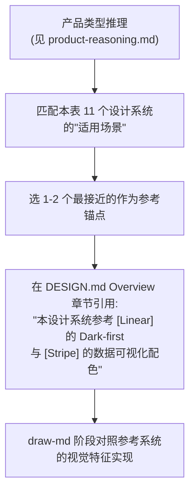

# 设计系统索引 —— 11 个真实参考系统

> 维度规范。LLM 在生成 UI 时倾向于"凭空设计",真实做法是参考已验证的设计系统并按需借鉴。本文索引 11 个公开、可学习的设计系统,每个含视觉特征 + 适用场景 + 借鉴要点。来源:taste-skill。

**使用方式**:在 [`product-reasoning.md`](../meta/product-reasoning.md) 推理出产品类型后,从本表选 1-2 个最接近的设计系统作为参考锚点,在 DESIGN.md 的 Overview 章节显式引用。

## 11 个设计系统

### 1. Vercel

- **URL**:vercel.com / vercel.com/geist
- **视觉特征**:极简黑白 + 单一品牌色(粉橙渐变 logo);Geist 字族(自家设计,几何无衬线);高对比;无装饰;微圆角(6-8px);阴影极少,层级靠 border + 背景色
- **适用场景**:开发者工具 / DevTool SaaS / 技术文档站
- **借鉴要点**:Geist 字体的几何感;黑白主导 + 单点强调色的克制;code block 的视觉处理
- **AI Tells 关联**:触发 [`ai-tells.md`](../meta/ai-tells.md) Lila Rule 时,可参考 Vercel 的"黑白 + 单色"作为反例

### 2. Linear

- **URL**:linear.app
- **视觉特征**:深色优先(Dark-first);紫蓝品牌色(深紫,非柔紫,符合 Lila Rule 例外);Inter Tight + 自定义 display;紧凑信息密度;键盘优先;command palette ⌘K;过渡动效丝滑(150-250ms)
- **适用场景**:B 端 SaaS / 项目管理 / 开发者协作工具
- **借鉴要点**:Dark-first 的克制(非纯黑,深灰梯度);键盘交互模式;过渡动效的"丝滑感"(cubic-bezier)
- **Dials 关联**:VARIANCE=3 / MOTION=4 / DENSITY=7

### 3. Stripe

- **URL**:stripe.com
- **视觉特征**:科技紫(Stripe 标志色);渐变 hero(克制,非 LLM 默认紫蓝粉);Camphor Mono + Sohne Sans;大量金融数据可视化;3D 元素(Stripe 由静态插画走向 WebGL);动画精确(数字计数、图表揭示)
- **适用场景**:金融科技 / 支付 / B 端 SaaS 营销站
- **借鉴要点**:渐变 hero 的克制用法(品牌色相内 2 阶);数据可视化配色;3D 元素作为差异化
- **Dials 关联**:VARIANCE=6 / MOTION=5 / DENSITY=5

### 4. Apple

- **URL**:apple.com
- **视觉特征**:SF Pro 字族;大留白;大字号 hero;产品图纯背景;视频主导;Liquid Glass(iOS 26+);克制色彩(产品色为主);滚动叙事(产品页一屏一焦点)
- **适用场景**:消费品 / 高端品牌 / 科技产品营销
- **借鉴要点**:留白节奏;视频 hero 的克制;滚动叙事的章节切分;Liquid Glass 实现(见 [`glass-effect.md`](./glass-effect.md))
- **Dials 关联**:VARIANCE=4 / MOTION=6 / DENSITY=2

### 5. Rauno

- **URL**:rauno.me
- **视觉特征**:极简个人站;黑白灰;Inter;动效精妙(border 动画、光标跟随);信息密度极低;monospace 强调
- **适用场景**:个人作品集 / 设计师主页 / 极简品牌站
- **借鉴要点**:极简的边界(信息密度 = 1);微动效的精确性;monospace 的工程感
- **Dials 关联**:VARIANCE=8 / MOTION=8 / DENSITY=1

### 6. Framer

- **URL**:framer.com
- **视觉特征**:鲜艳品牌色(蓝紫,但搭配克制);大字号 display;强动效(滚动视差、pin sticky);交互式 demo 嵌入;产品截图为主
- **适用场景**:设计工具 / SaaS 营销 / 产品发布
- **借鉴要点**:滚动动效的节奏;交互式 demo 的嵌入方式;大字号 display 的克制(不滥用)
- **Dials 关联**:VARIANCE=7 / MOTION=8 / DENSITY=4

### 7. Notion

- **URL**:notion.com
- **视觉特征**:温暖中性色(米白底);手绘风插画;Inter + 自定义 display;信息密集但留白合理;block-based 内容;emoji 作为视觉锚点
- **适用场景**:笔记 / 文档 / 协作工具 / 知识管理
- **借鉴要点**:温暖中性色的克制(非纯白);block-based 的信息组织;emoji 的功能性使用(非装饰)
- **Dials 关联**:VARIANCE=3 / MOTION=2 / DENSITY=6

### 8. GitHub

- **URL**:github.com / primer.style
- **视觉特征**:中性灰主导;蓝绿强调色;Mono + Sans 分工;代码优先;密度高(代码仓库列表);状态色彩丰富(open/closed/merged)
- **适用场景**:开发者平台 / 代码托管 / 项目协作
- **借鉴要点**:状态色的语义化(open=绿 / closed=红 / merged=紫);代码块的视觉处理;密度优先的列表设计
- **Dials 关联**:VARIANCE=2 / MOTION=2 / DENSITY=8

### 9. Figma

- **URL**:figma.com
- **视觉特征**:多彩(产品色丰富,但 UI 克制);Inter;toolbar / canvas / panel 三段式;浮动工具栏;实时协作光标;动效克制(状态过渡为主)
- **适用场景**:设计工具 / 协作平台 / 创意工具
- **借鉴要点**:三段式布局(toolbar + canvas + panel);浮动工具栏的视觉处理;多色产品的 UI 克制
- **Dials 关联**:VARIANCE=3 / MOTION=3 / DENSITY=6

### 10. Tailwind CSS

- **URL**:tailwindcss.com
- **视觉特征**:中性灰(slate / zinc);橙色品牌色;Inter;代码即文档;side-by-side 代码 + 预览;紧凑导航
- **适用场景**:开发者文档 / 工具站 / 开源项目
- **借鉴要点**:side-by-side 代码 + 预览的范式;文档导航的信息架构;中性灰的克制
- **Dials 关联**:VARIANCE=2 / MOTION=2 / DENSITY=6

### 11. Airbnb

- **URL**:airbnb.design / airbnb.com
- **视觉特征**:Cereal 字族(自定义);温暖红;卡片为主的列表;图片主导(目的地);圆角大(8-16px);微动效(卡片 hover 缩放)
- **适用场景**:旅游 / 电商 / 内容社区 / Marketplace
- **借鉴要点**:卡片列表的节奏;图片主导的视觉;圆角的克制使用;hover 微动效
- **Dials 关联**:VARIANCE=4 / MOTION=4 / DENSITY=5

## 选型决策



**禁止**:照搬(违反品牌识别);引用 2 个以上参考系统(混乱);引用未在本表的"小道消息参考"(无验证来源)。

## 扩展规则

- 本表是 closed set 的初始版本,可扩展;扩展时必须含 URL + 视觉特征 + 适用场景 + 借鉴要点 + Dials 关联
- 扩展优先级:被多个产品类型引用 > 单一产品类型;公开可访问 > 私有 / 内部
- 不收录:纯模板站(Bootstrap / Material 默认);已停更 / 失效的设计系统

## brief → 设计系统包映射表(11 个组件库 / token 系统)

> 上文 11 个"真实参考系统"侧重**视觉特征借鉴**;本表侧重**可引入的组件库 / token 系统**,从 brief 推理该选哪个包作为实现基础。每个包含定位 / 适用场景 / token 命名风格 / 与 maliang DESIGN.md 的桥接建议。来源:taste-skill。

### 选包决策流

```
brief → 产品类型推理(见 product-reasoning.md)→ 匹配下表"适用场景" → 选 1 个包作为实现基础
  → maliang DESIGN.md 的 token 用该包的命名风格导出 → 组件直接用该包或包装
```

### 11 个设计系统包

#### 1. Fluent UI(Microsoft)

- **定位**:微软生态跨平台组件库(Web / Win / iOS / Android),Fluent 2 设计语言
- **适用场景**:企业 SaaS(微软生态)、Office 插件、Teams 应用、Azure 工具
- **token 命名**:`colorBrandBackground`、`spacingHorizontalM`、`fontSizeBase600`(camelCase + 语义后缀)
- **桥接建议**:DESIGN.md `colors:` 导出为 Fluent token 时,`primary` → `colorBrandBackground`,`neutral` → `colorNeutralBackground1`;圆角 token 对应 `cornerRadiusLarge/Medium/Small`

#### 2. Carbon(IBM)

- **定位**:IBM 企业级设计系统,数据密集型 B 端首选
- **适用场景**:企业 dashboard、数据可视化、金融 / 保险 B 端、AI 工具站
- **token 命名**:`$background`、`$text-primary`、`$spacing-05`、`$layout-lg`(kebab + 编号档位)
- **桥接建议**:DESIGN.md `spacing:` 用 8px base 对齐 Carbon `spacing-05`(40px);`typography:` 用 Carbon 编号(`heading-03` / `body-long-01`)

#### 3. Polaris(Shopify)

- **定位**:Shopify 电商后台设计系统,商户工具首选
- **适用场景**:电商后台、多租户 SaaS、内容管理、支付流程
- **token 命名**:`--p-color-bg`、`--p-space-4`、`--p-font-size-325`(双连字符 + `p-` 前缀)
- **桥接建议**:DESIGN.md token 加 `--p-` 前缀导出;Polaris 的 `Card` / `DataTable` / `FormLayout` 可直接包装为 maliang 组件

#### 4. Atlaskit(Atlassian)

- **定位**:Atlassian 协作工具设计系统(Jira / Confluence 同源)
- **适用场景**:项目管理、协作工具、Wiki / 知识库、DevOps 看板
- **token 命名**:`@atlaskit/tokens` 动态 token(`color.background.accent.blue`、`space.200`),点分路径
- **桥接建议**:DESIGN.md token 用点分路径映射(`colors.primary` → `color.background.accent.blue`);Atlaskit 的 `Modal` / `Select` / `Tree` 可直接复用

#### 5. Primer(GitHub)

- **定位**:GitHub 全产品线设计系统,代码优先 + 状态色语义化
- **适用场景**:开发者平台、代码托管、DevOps 工具、开源项目站
- **token 命名**:`var(--fgColor-default)`、`var(--control-bgColor-rest)`、`var(--space-2)`(语义化 + 状态后缀)
- **桥接建议**:DESIGN.md token 加状态后缀(`primary-rest` / `primary-hover`);Primer 的状态色(open/closed/merged)直接复用语义

#### 6. GOV.UK

- **定位**:英国政府公共服务设计系统,无障碍 + 合规首选
- **适用场景**:政府站、公共服务、合规金融、医疗、教育公共部门
- **token 命名**:`$govuk-colour-blue`、`$govuk-font-19`、`$govuk-gutter`(双连字符 + `govuk-` 前缀 + 编号)
- **桥接建议**:DESIGN.md 强制 WCAG AAA(非 AA);`typography:` 用 GOV.UK 字号编号(`font-19` = 19px);禁用装饰性动画

#### 7. USWDS(美国网页设计系统)

- **定位**:美国政府设计系统,标准化公共信息
- **适用场景**:美国政府站、联邦机构、公共数据展示
- **token 命名**:`theme-color-primary`、`theme-grid-gap-mobile-lg`(语义 + 断点后缀)
- **桥接建议**:DESIGN.md token 加断点后缀(`spacing-md-mobile` / `spacing-md-desktop`);USWDS 的 `usa-banner` / `usa-nav` 可直接复用

#### 8. Bootstrap

- **定位**:最广泛使用的 CSS 框架,快速原型 + 传统企业站
- **适用场景**:内部工具、传统企业官网、快速 MVP、教学示例
- **token 命名**:`--bs-primary`、`--bs-body-color`、`--bs-border-radius`(双连字符 + `bs-` 前缀)
- **桥接建议**:DESIGN.md token 加 `--bs-` 前缀导出;**注意**:Bootstrap 默认风格易触发 [`ai-tells.md`](../meta/ai-tells.md) "通用感",需深度定制 token

#### 9. Radix Themes

- **定位**:无样式 Radix Primitives 的主题层,现代化 + 无障碍优先
- **适用场景**:现代 SaaS、开发者工具、需要深度定制的 React 应用
- **token 命名**:`--gray1`~`--gray12`、`--blue9`、`--space-5`(编号制 + 色阶)
- **桥接建议**:DESIGN.md `colors:` 用 Radix 12 阶色阶(`gray1`~`gray12`);Radix Themes 的 `Theme` 组件可直接接受 DESIGN.md token 作为 `accentColor`

#### 10. shadcn/ui

- **定位**:可复制粘贴的 React 组件集合(非 npm 包),Tailwind + Radix 底层
- **适用场景**:Next.js / Remix 项目、创业公司、需要完全控制的组件库
- **token 命名**:`--background`、`--primary`、`--radius`(HSL 变量 + 语义命名)
- **桥接建议**:DESIGN.md token 直接导出为 shadcn/ui 的 CSS 变量(`--primary` / `--background`);shadcn/ui 的 `components.json` 可配置 DESIGN.md 作为 token 源

#### 11. Tailwind CSS

- **定位**:原子化 CSS 框架,非组件库但提供 token 系统
- **适用场景**:任何 Web 项目(作为 token 底座)、文档站、开发者工具
- **token 命名**:`colors.primary.500`、`spacing.4`、`fontSize.lg`(对象路径 + 编号档位)
- **桥接建议**:DESIGN.md 用 `npx @google/design.md export --format json-tailwind` 直接导出为 `tailwind.config.js` 的 `theme` 对象;`spacing:` base 必须 4 或 8(对齐 Tailwind 默认)

### 选包约束(硬性)

- **单项目 ≤ 1 个包**:禁止混用(如 Bootstrap + shadcn/ui),token 命名冲突 + 维护成本爆炸
- **token 命名对齐**:选定包后,DESIGN.md 导出必须用该包的命名风格(不可用 maliang 默认 kebab-case 导出给 Fluent UI,需转 camelCase)
- **ai-tells 关联**:Bootstrap / Material 默认风格易触发"通用感",选这些包必须深度定制 token(改色相 + 改圆角 + 改字族)
