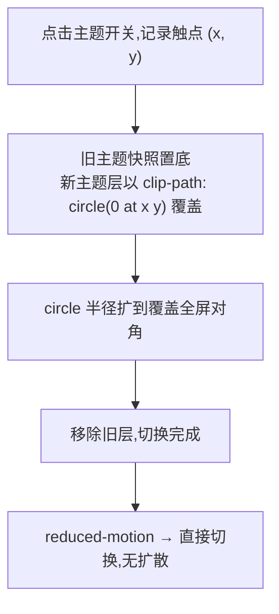

# Circular Reveal —— 圆形扩散主题切换骨架

> Framework 模板。主题切换(明↔暗)以**触点为圆心**做 `clip-path: circle()` 扩散揭示新主题:裁切不缩放,底下内容不变形。优先 View Transitions API,降级双层 DOM。来源:UI 交互教学视频转录提取(2026-09,叨叨AI)。MOTION_INTENSITY 3-7 适用(见 [`dials.md`](../meta/dials.md))。

## 视觉效果



## View Transitions 实现(首选)

```js
async function toggleTheme(e) {
  const x = e.clientX, y = e.clientY;
  const radius = Math.hypot(
    Math.max(x, innerWidth - x),
    Math.max(y, innerHeight - y));            // 覆盖全屏的最小半径

  const reduce = matchMedia('(prefers-reduced-motion: reduce)').matches;
  const apply = () => document.documentElement.classList.toggle('dark');
  if (reduce || !document.startViewTransition) { apply(); return; }

  const vt = document.startViewTransition(apply);
  await vt.ready;
  document.documentElement.animate(
    { clipPath: [`circle(0px at ${x}px ${y}px)`, `circle(${radius}px at ${x}px ${y}px)`] },
    { duration: 450, easing: 'cubic-bezier(0.23, 1, 0.32, 1)',
      pseudoElement: '::view-transition-new(root)' });
}
```

```css
::view-transition-old(root), ::view-transition-new(root) {
  animation: none;            /* 关闭默认交叉淡化,交给 clip-path */
  mix-blend-mode: normal;
}
```

## 降级实现(无 View Transitions 的浏览器)

```js
// 双层:旧主题截图(或克隆层)置底,新主题真实 DOM 覆盖其上做 circle 展开
overlay.style.clipPath = `circle(0px at ${x}px ${y}px)`;
apply();
requestAnimationFrame(() => {
  const anim = overlay.animate(
    { clipPath: [`circle(0px at ${x}px ${y}px)`, `circle(${radius}px at ${x}px ${y}px)`] },
    { duration: 450, easing: 'cubic-bezier(0.23,1,0.32,1)' });
  anim.onfinish = () => overlay.remove();
});
```

## 强制规则

- **必须**实现 `prefers-reduced-motion` 降级:直接切换(见 [`accessibility.md`](../meta/accessibility.md) 第 2 节)
- **裁切不缩放**:揭示层用 `clip-path` 而非 `transform: scale()`,底下文字/布局零变形
- 扩散半径 = 触点到最远屏角距离(`Math.hypot`),禁止写死固定值
- 时长 400-500ms(浮层转场档 ≤ 400ms 上限可放宽至 450ms,属整页转场);缓动一律 ease-out 长尾
- 切换期间禁止二次触发(以 `vt.ready`/动画进行中为锁)
- 旧层是静态快照:切换期间发生的滚动/数据变化在完成后自然呈现,不做补间

## 失败模式

| 触发条件 | 处理 |
| --- | --- |
| 全屏闪一下旧主题 | 默认交叉淡化未关;`::view-transition-old/new` 的 `animation: none` 必须显式 |
| 圆心错位 | 触点坐标用了元素相对坐标;换 `clientX/clientY` 视口坐标 |
| 页面滚动后圆心偏 | 快照层未固定;`::view-transition` 层默认 fixed,确认没有自定义成 absolute |
| 文字被缩放变形 | 误用 `transform: scale` 揭示;改 `clip-path: circle` |
| 二次点击无效或错乱 | 动画进行中未加锁;进行中直接 return 或排队 |
| Safari 老版本无反应 | 无 `startViewTransition` 时降级分支未兜底;先判特性再走 VT |
