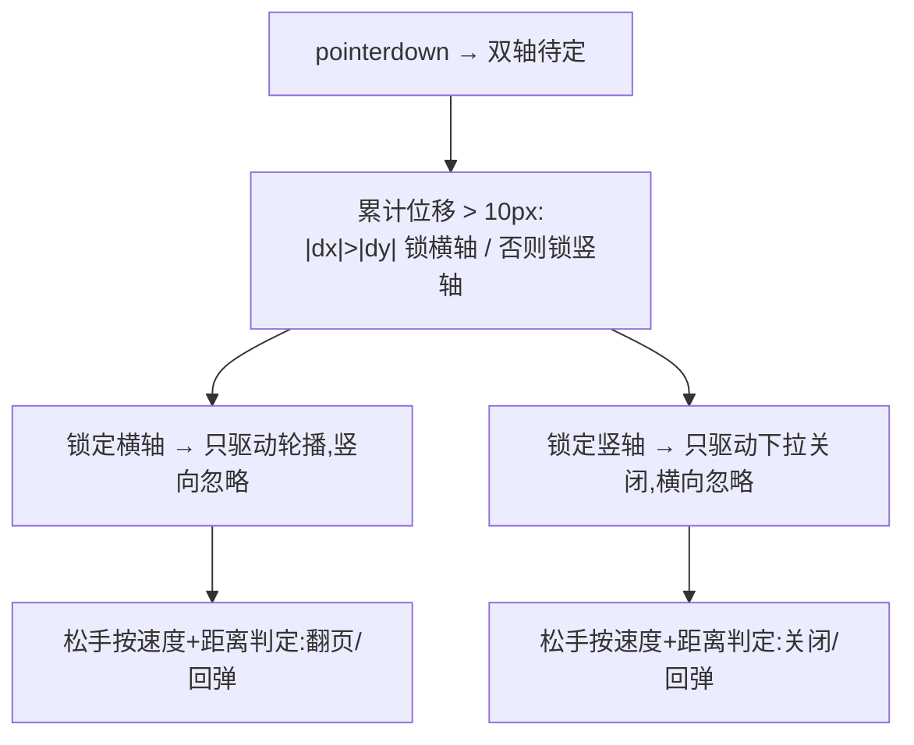

# Gesture Arbitration —— 手势方向竞争仲裁骨架

> Framework 模板。一根手指同时压住两个可交互轴(横滑翻页 ↔ 竖拉关闭)时,起手位移超过阈值即**锁定轴向**,此后只响应锁定轴、另一轴完全忽略;中途不换轴。来源:UI 交互教学视频转录提取(2026-09,叨叨AI)。MOTION_INTENSITY 3-7 适用(见 [`dials.md`](../meta/dials.md))。

## 视觉效果



## 核心原则

- **锁定一次性**:首次越阈值即锁,指针抬起前不重判(中途换轴是最常见抖动根源)
- **位移+速度双判**:松手时距离过阈值**或**瞬时速度超阈值即完成动作(见 [`vocabulary/scroll.md`](../vocabulary/scroll.md) 的速度语义);甩动落点先**动量投影**再吸附最近槽位(公式见 [`interruptible-motion.md`](interruptible-motion.md) 手势物理三公式②),速度符号决定 commit/reverse——下方 `flung` 分支的 `vx` 符号判向即其最小实现
- 未锁轴保持原状,不跟随任何小位移(否则像"松的")

## HTML 结构

```html
<div class="pager" id="pager">
  <div class="page">1</div>
  <div class="page">2</div>
  <div class="page">3</div>
</div>
```

## CSS

```css
.pager {
  display: flex; width: 100%; overflow: hidden;
  touch-action: pan-y;   /* 交给 JS 仲裁横轴;竖向留给页面滚动兜底 */
}
.page { flex: 0 0 100%; }
.pager.dragging { transition: none; }
```

## 原生 JavaScript(无依赖,GSAP 可选做回弹)

```js
const pager = document.getElementById('pager');
let g = null;                                   // 手势上下文
const LOCK_PX = 10;                             // 轴向锁定阈值
const COMMIT_RATIO = 0.35, V_COMMIT = 0.5;      // 距离比 / px·ms⁻¹ 速度阈值

pager.addEventListener('pointerdown', (e) => {
  g = { sx: e.clientX, sy: e.clientY, t0: performance.now(),
        axis: null, base: -gsap.getProperty(pager, 'x') || 0, vx: 0, lx: e.clientX, lt: e.t0 || e.timeStamp };
  pager.classList.add('dragging');
  pager.setPointerCapture(e.pointerId);
});

pager.addEventListener('pointermove', (e) => {
  if (!g) return;
  const dx = e.clientX - g.sx, dy = e.clientY - g.sy;
  if (!g.axis) {
    if (Math.hypot(dx, dy) < LOCK_PX) return;
    g.axis = Math.abs(dx) > Math.abs(dy) ? 'x' : 'y';
    if (g.axis === 'y') { pager.classList.remove('dragging'); } // 竖轴交还页面滚动
  }
  if (g.axis !== 'x') return;
  const now = performance.now();
  g.vx = (e.clientX - g.lx) / Math.max(1, now - g.lt);
  g.lx = e.clientX; g.lt = now;
  gsap.set(pager, { x: g.base + dx });          // 仅锁定轴驱动
});

pager.addEventListener('pointerup', () => {
  if (!g) return;
  pager.classList.remove('dragging');
  if (g.axis === 'x') {
    const idx = Math.round(g.base / pager.clientWidth);
    const flung = Math.abs(g.vx) > V_COMMIT;    // 甩动可越过大半页
    const step = flung ? (g.vx < 0 ? 1 : -1) : 0;
    const next = Math.max(0, Math.min(2,
      flung ? currentIndex() + step : (Math.abs(g.base % pager.clientWidth) / pager.clientWidth > COMMIT_RATIO ? idx : currentIndex())));
    gsap.to(pager, { x: -next * pager.clientWidth, duration: 0.3, ease: 'power2.out' });
  }
  g = null;
});

function currentIndex() { return Math.round(-gsap.getProperty(pager, 'x') / pager.clientWidth); }
```

## 强制规则

- **必须**实现 `prefers-reduced-motion` 降级:回弹改为直接切页(见 [`accessibility.md`](../meta/accessibility.md) 第 2 节)
- **必须**用 `transform` 驱动,`transition: none` 在拖拽态,松手才恢复(见 [`performance.md`](../meta/performance.md))
- 轴向锁定阈值 8-12px;锁定前的微小位移在松手时必须完全归零(未锁轴动作"不算数",参考按钮滑出取消语义)
- 锁定竖轴时立刻把控制权交还页面滚动(`touch-action: pan-y` 配合),禁止再拦截
- 点按(总位移 < 6px)不计为滑动手势,正常派发 click
- 页面级转场动画时长 ≤ 400ms(见 [`micro-interactions.md`](../vocabulary/micro-interactions.md) 分层口径)
- 回弹 / 落定用 JS 弹簧驱动;本骨架的手势段禁用 CSS transition 驱动(CSS 过渡无法中途抓取反转,见 [`ROUTING.md`](ROUTING.md) R1 死法栏)

## 帧级平滑

> 顺滑是「帧里有什么」的问题,不只是帧率问题。来源:apple-design(§11),2026-09 吸收。

- **per-frame 位移守住感知阈值**:每帧位置增量过小会产生频闪感(strobing);手势速度天然连续,但动画回弹段若逐帧位移忽大忽小,肉眼读作卡顿——回弹用弹簧连续插值(见 [`interruptible-motion.md`](interruptible-motion.md) 两参数模型),禁止分段补间。
- **极快速运动用 motion blur / stretch 编码速度**:轻微拉伸或模糊比一条生硬的锐利轨迹更可读;Web 无原生 motion blur,用 `scale` 沿运动轴向拉伸(stretch)近似。
- **只动 compositor 友好属性**:逐帧跟随只允许 `transform` / `opacity`,配 `will-change` 在运动临近前提示(不常驻 CSS);触 `width`/`top`/`filter` 的逐帧计算必然掉帧。

## 失败模式

| 触发条件 | 处理 |
| --- | --- |
| 斜向拖动抖动换轴 | 每帧重判轴向;改为首次越阈值一次性锁定 |
| 横滑时页面跟着竖滚 | 未锁定轴就 set 了位移;锁定前禁止驱动任何 transform |
| 甩一半停住不动 | 速度阈值判定的回弹 tween 未建;flung 分支必须始终落到一个确定页 |
| 移动端手势被浏览器抢走 | 缺 `touch-action` 声明或缺 `setPointerCapture` |
| 点按被吞 | 未做 < 6px 位移豁免,click 被 pointer 逻辑拦截 |
| 快速连滑叠帧 | 上一次回弹 tween 未 kill;新建前 `gsap.killTweensOf(pager)` |
