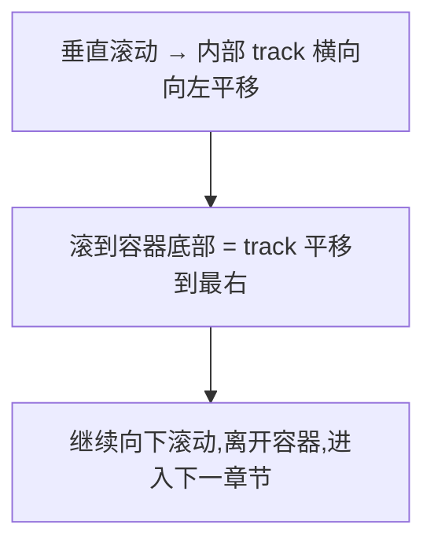

# Horizontal Pan —— 横向平移 GSAP 骨架

> Framework 模板。垂直滚动驱动横向位移,内容从右向左平移。来源:taste-skill。MOTION_INTENSITY ≥ 7 适用(见 [`dials.md`](../meta/dials.md))。常见于品牌站、作品集、产品发布页。

## 视觉效果



## HTML 结构

```html
<section class="pan-container">
  <div class="pan-track">
    <div class="pan-panel">Panel 1</div>
    <div class="pan-panel">Panel 2</div>
    <div class="pan-panel">Panel 3</div>
    <div class="pan-panel">Panel 4</div>
    <div class="pan-panel">Panel 5</div>
  </div>
</section>
```

## CSS

```css
.pan-container {
  position: relative;
  height: 400vh; /* 容器高度 = 视口高度 × (panel 数 - 1) */
}
.pan-track {
  position: sticky;
  top: 0;
  height: 100vh;
  display: flex;
  overflow: hidden;
  will-change: transform;
}
.pan-panel {
  flex: 0 0 100vw;
  height: 100vh;
  display: flex;
  align-items: center;
  justify-content: center;
}
```

## GSAP JavaScript

```js
import gsap from 'gsap';
import { ScrollTrigger } from 'gsap/ScrollTrigger';
gsap.registerPlugin(ScrollTrigger);

const track = document.querySelector('.pan-track');
const panels = document.querySelectorAll('.pan-panel');
const totalPanels = panels.length;

// 计算 track 需要平移的距离
const panDistance = () => track.scrollWidth - window.innerWidth;

const horizontalScroll = gsap.to(track, {
  x: () => -panDistance(),
  ease: 'none',
  scrollTrigger: {
    trigger: '.pan-container',
    start: 'top top',
    end: () => `+=${panDistance()}`,
    scrub: 1,
    invalidateOnRefresh: true, // 窗口 resize 时重新计算
  },
});

// reduced-motion 降级(强制)
const prefersReducedMotion = window.matchMedia('(prefers-reduced-motion: reduce)');
if (prefersReducedMotion.matches) {
  horizontalScroll.kill();
  gsap.set(track, { x: 0, clearProps: 'all' });
  // 改为水平 scroll-snap 容器
  track.style.overflowX = 'auto';
  track.style.scrollSnapType = 'x mandatory';
  panels.forEach(p => p.style.scrollSnapAlign = 'start');
}
```

## 进阶:Panel 揭示动画

每个 panel 进入视口时,内部内容做揭示动画(不依赖横向位移):

```js
panels.forEach((panel, index) => {
  const content = panel.querySelectorAll('.reveal');
  gsap.from(content, {
    y: 30,
    opacity: 0,
    duration: 0.6,
    stagger: 0.1,
    ease: 'power2.out',
    scrollTrigger: {
      trigger: panel,
      containerAnimation: horizontalScroll,
      start: 'left center',
      end: 'right center',
      toggleActions: 'play none none reverse',
    },
  });
});
```

## 强制规则

- **必须**实现 `prefers-reduced-motion` 降级到水平 scroll-snap
- **必须**用 `transform: translateX` 而非 `left` / `margin-left`
- **必须**用 `invalidateOnRefresh: true` 处理 resize
- panel 数量 ≤ 8 个(超过性能下降)
- 每屏宽度统一(`flex: 0 0 100vw`),不可混用宽度

## 失败模式

| 触发条件                  | 处理                                       |
| ------------------------- | ------------------------------------------ |
| iOS Safari momentum scroll 异常 | 加 `ScrollTrigger.config({ ignoreMobileResize: true })` |
| resize 后位置错乱         | 检查 `invalidateOnRefresh`                |
| panel 内图片懒加载未触发  | 用 ScrollTrigger `onEnter` 触发 lazy load |
| reduced-motion 下仍平移   | kill 横向动画并改为 scroll-snap            |
