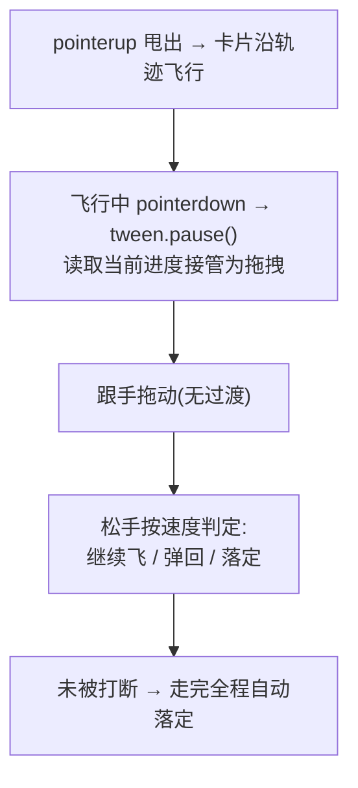

# Interruptible Motion —— 可中断动画骨架

> Framework 模板。动画进行中用户可随时接管:按住飞行动画中的元素即暂停在手指下并转为拖拽,松手按速度决定继续/回弹。来源:UI 交互教学视频转录提取(2026-09,西瓜同学)。MOTION_INTENSITY 3-7 适用(见 [`dials.md`](../meta/dials.md))。

## 视觉效果



## 核心原则

动画进度必须有**单一数据源**(tween 的 progress),不允许 fire-and-forget 式播放。接管时读进度、暂停、把当前 transform 作为拖拽起点——直接重启动画会造成视觉跳变。

## HTML 结构

```html
<div class="board">
  <div class="fly-card" id="card">卡片</div>
  <div class="drop-zone">目标区</div>
</div>
```

## CSS

```css
.fly-card {
  position: absolute;
  width: 120px;
  touch-action: none;      /* 接管指针事件,禁掉原生滚动手势冲突 */
  user-select: none;
  /* will-change 不在 CSS 常驻,由 JS 动画前设置 */
}
.fly-card.dragging { transition: none; }  /* 拖拽态关闭一切过渡,只跟手 */
```

## GSAP JavaScript

```js
import gsap from 'gsap';

const card = document.getElementById('card');
let drag = null;

function flyTo(zone) {
  card.style.willChange = 'transform';
  return gsap.to(card, {
    x: zone.offsetLeft, y: zone.offsetTop, scale: 0.9,
    duration: 0.6, ease: 'power2.out',
    onComplete: () => { card.style.willChange = 'auto'; },
  });
}

// 起飞:记录当前 tween,供中断
let flight = flyTo(document.querySelector('.drop-zone'));

card.addEventListener('pointerdown', (e) => {
  const st = flight && flight.isActive() ? flight.progress() : 0;
  if (flight) flight.pause();                    // 关键:暂停而非 kill,保留进度
  const r = card.getBoundingClientRect();
  drag = { sx: e.clientX, sy: e.clientY, ox: gsap.getProperty(card, 'x'),
           oy: gsap.getProperty(card, 'y'), interrupted: st > 0 && st < 1 };
  card.classList.add('dragging');
  card.setPointerCapture(e.pointerId);
});

card.addEventListener('pointermove', (e) => {
  if (!drag) return;
  gsap.set(card, { x: drag.ox + (e.clientX - drag.sx),
                   y: drag.oy + (e.clientY - drag.sy) });
});

card.addEventListener('pointerup', () => {
  card.classList.remove('dragging');
  drag = null;
  // 松手按实时速度判定去留(配合 inertia 插件或手动测速);此处简化为落回目标
  flight = flyTo(document.querySelector('.drop-zone'));
});
```

## 强制规则

- **必须**实现 `prefers-reduced-motion` 降级:直接切换位置,无飞行动画(见 [`accessibility.md`](../meta/accessibility.md) 第 2 节)
- **必须**用 `transform` + `opacity`(见 [`performance.md`](../meta/performance.md));接管瞬间 `transition: none`
- **必须** `tween.pause()` 读取 `progress()` 接管,禁止 kill 后从 0 重播
- 拖拽态与动画态互斥:进入拖拽态先暂停所有相关 tween
- 接住动作不计为点击(与 click 语义区分,避免误触发)
- 悬浮元素上的接管手势需 `touch-action: none`,否则移动端被滚动抢走

## 失败模式

| 触发条件 | 处理 |
| --- | --- |
| 接住瞬间卡片跳动 | 未读当前进度就从 0 重播;改为 `pause()` + 读取实时 transform |
| 移动端接不住(页面滚走) | 元素缺 `touch-action: none` |
| 松手后动画不继续 | 拖拽态未清除 `transition: none`;确认 class 移除后再建新 tween |
| 连续快速接放抖动 | 对同一 tween 复用句柄,避免叠加重启 |
| 接住后 pointerup 丢事件 | 未 `setPointerCapture`,指针移出元素后收不到 up |
