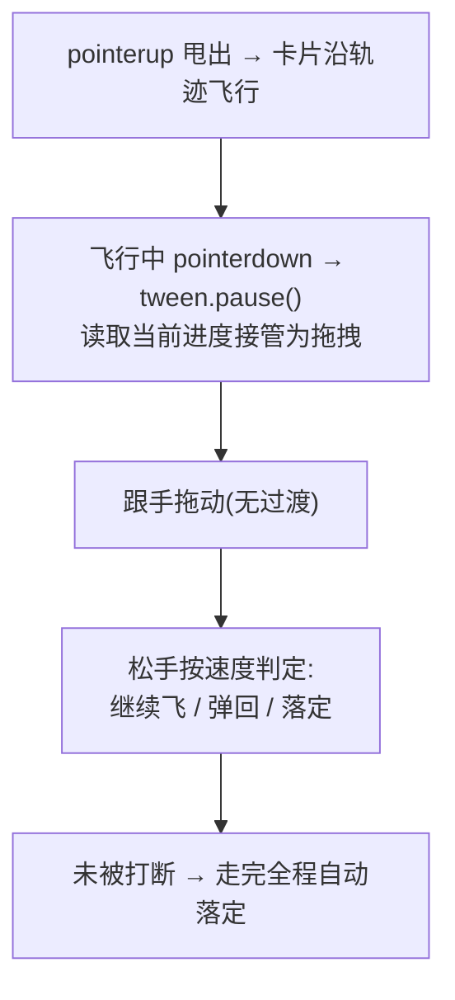

# Interruptible Motion —— 可中断动画骨架

> Framework 模板。动画进行中用户可随时接管:按住飞行动画中的元素即暂停在手指下并转为拖拽,松手按速度决定继续/回弹。来源:UI 交互教学视频转录提取(2026-09,西瓜同学)。MOTION_INTENSITY 3-7 适用(见 [`dials.md`](../meta/dials.md))。
>
> 2026-09 吸收增补:可中断性四法则、弹簧两参数模型、手势物理三公式(来源:apple-design,思想中文重写;三框架 API 已对官方文档核实,核实不了的标注「待实测」)。

## 视觉效果



## 核心原则

动画进度必须有**单一数据源**(tween 的 progress),不允许 fire-and-forget 式播放。接管时读进度、暂停、把当前 transform 作为拖拽起点——直接重启动画会造成视觉跳变。

**可中断性四法则**(任何可被用户触摸的动效都适用):

1. **过渡期间永不锁输入**。转场不是「播放视频」,用户随时可能改变主意;锁输入的过渡是把界面 temporarily 变成电影。
2. **永远从当前呈现值启动新动画,不从目标值**。中断时读取元素实时 transform 作为新动画起点;从逻辑值/目标值启动会跳变。单一数据源原则是它的实现面。
3. **2D 位移拆成独立的 X / Y 两个弹簧**。单个弹簧驱动二维距离,当 X 与 Y 速度不同步时会失谐(斜向拖拽回弹走弧线而不是两轴各自归位)。
4. **手势驱动的动效一律禁用 CSS transition / @keyframes**(含预烘焙的 CSS `linear()` 弹簧曲线)——它们无法中途抓取、无法反转、无法继承手指速度。弹簧由 JS 逐帧驱动,天然从当前值动画,这正是可中断性需要的(此条已同步写入 [`ROUTING.md`](ROUTING.md) R1 死法栏)。

**手势反转时混合速度,不硬切**:在反转点用一个新动画替换旧动画会产生速度不连续——「砖墙」感。带速度的重定向(velocity blend / iOS additive animations)消除它;Web 选弹簧库时把「re-target 时继承当前速度」作为硬性选型条件。

## HTML 结构

```html
<div class="board">
  <div class="fly-card" id="card">卡片</div>
  <div class="drop-zone">目标区</div>
</div>
```

## CSS

```css
.fly-card {
  position: absolute;
  width: 120px;
  touch-action: none;      /* 接管指针事件,禁掉原生滚动手势冲突 */
  user-select: none;
  /* will-change 不在 CSS 常驻,由 JS 动画前设置 */
}
.fly-card.dragging { transition: none; }  /* 拖拽态关闭一切过渡,只跟手 */
```

## GSAP JavaScript

```js
import gsap from 'gsap';

const card = document.getElementById('card');
let drag = null;

function flyTo(zone) {
  card.style.willChange = 'transform';
  return gsap.to(card, {
    x: zone.offsetLeft, y: zone.offsetTop, scale: 0.9,
    duration: 0.6, ease: 'power2.out',
    onComplete: () => { card.style.willChange = 'auto'; },
  });
}

// 起飞:记录当前 tween,供中断
let flight = flyTo(document.querySelector('.drop-zone'));

card.addEventListener('pointerdown', (e) => {
  const st = flight && flight.isActive() ? flight.progress() : 0;
  if (flight) flight.pause();                    // 关键:暂停而非 kill,保留进度
  const r = card.getBoundingClientRect();
  drag = { sx: e.clientX, sy: e.clientY, ox: gsap.getProperty(card, 'x'),
           oy: gsap.getProperty(card, 'y'), interrupted: st > 0 && st < 1 };
  card.classList.add('dragging');
  card.setPointerCapture(e.pointerId);
});

card.addEventListener('pointermove', (e) => {
  if (!drag) return;
  gsap.set(card, { x: drag.ox + (e.clientX - drag.sx),
                   y: drag.oy + (e.clientY - drag.sy) });
});

card.addEventListener('pointerup', () => {
  card.classList.remove('dragging');
  drag = null;
  // 松手按实时速度判定去留;生产实现按「手势物理三公式」节交接速度/投影落点
  flight = flyTo(document.querySelector('.drop-zone'));
});
```

## 弹簧两参数模型

> 上游把物理三元组(mass/stiffness/damping)替换为两个设计师友好的参数。来源:apple-design(§4),2026-09 吸收;三框架 API 已对官方文档核实。

- **damping ratio(阻尼比)** — 控制过冲:`1.0` 临界阻尼(无回弹,平滑落定);`< 1.0` 过冲振荡,越低越弹。
- **response(响应,秒)** — 多快到达目标。**它不是 duration**——弹簧没有固定时长,落定时间由参数涌现。

**默认法则**:一切 UI 默认 `damping = 1.0`(优雅不打扰);仅当**手势本身带动量**(甩出、抛掷、拖拽释放)才降到 `~0.8` 加回弹。凭空出现的菜单带回弹是错的,被甩出去的卡片带回弹才是对的。

**Apple 实船参考值**:

| 交互             | damping | response |
| ---------------- | ------- | -------- |
| 位移 / 重新定位(如画中画) | 1.0     | 0.4      |
| 旋转             | 0.8     | 0.4      |
| drawer / sheet   | 0.8     | 0.3      |

**三框架映射**(逐一核实,2026-09):

| 框架 | 落点 | 对应关系 |
| --- | --- | --- |
| Flutter | `SpringDescription.withDampingRatio(mass, stiffness, ratio)` + `SpringSimulation`(physics 库,api.flutter.dev) | `ratio` 即 damping ratio(1.0 临界);**response 无直接参数**,按标准二阶系统换算 `stiffness = (2π/response)² × mass`(换算式为通用弹簧物理,非 Flutter 官方 API,落地时实测验算) |
| HarmonyOS | `curves.springMotion(response, dampingFraction)`(ArkUI 官方指南:时长由参数、属性变化与初速度自动计算,指定的 duration 不生效);跟手+离手场景用 `curves.responsiveSpringMotion`(自动继承跟手段速度) | 直接两参数,最贴近本模型。注意:`curves.springCurve(velocity, mass, stiffness, damping)` 是另一个 4 参数物理 API,官方注明「时长映射破坏物理规律,不建议使用」,勿混用 |
| Web | 预烘焙:CSS `linear()` 弹簧曲线(Chrome 113+ / Firefox 112+ / Safari 17.2+),bounce+duration 近似 damping+response——**固定时长、不能中途改目标**,只适合无交互转场;可中断场景:JS rAF 逐帧积分,或选支持 velocity 重定向的弹簧库(如 Motion 的 `type: 'spring', bounce, duration`) | 可中断性需求(核心原则法则④)排除一切预烘焙曲线 |

## 手势物理三公式

> 松手瞬间把手指运动交给动画的三个公式。来源:apple-design(§5/§6/§9,出自 Designing Fluid Interfaces 示例代码),2026-09 吸收。

**① 速度交接(velocity handoff)**——拖拽与动画之间不能有接缝,动画必须以手指的实时速度开始:

```
relativeVelocity = v / (target − current)
```

部分弹簧 API 要**相对速度**(按剩余距离归一):元素在 y=50、目标 y=150(剩 100px),手指 50px/s → 初速度 0.5。Motion/Framer 类 API 直接收绝对 px/s,传原始值即可。

**② 动量投影(momentum projection)**——不要从松手点吸附最近边界,先按速度**投影静止点**再吸附最近的吸附点,这才像「把元素抛出去」:

```
projected = current + (v / 1000) × d / (1 − d)    // d ≈ 0.998 普通滚动感;0.99 更干脆
target     = nearestSnapPoint(projected)           // 先定投影落点
springTo(target, { velocity: v })                  // 再按 ① 交接速度
```

物理教科书式 `v²/2a` 不是实船行为,用上述**指数衰减**形式(底部抽屉 / 轮播的标准手感)。配合**速度符号决定 commit/reverse**:v 为负走下一吸附点、为正回弹(见 [`gesture-arbitration.md`](gesture-arbitration.md) 的 `flung` 分支)。

**③ 橡皮筋(rubber-banding)**——边界处渐进阻抗而非硬停;硬停读作「冻住了」,连续阻抗读作「有响应,但没更多了」:

```
rubberband(overshoot, dimension, c = 0.55) =
  (overshoot × dimension × c) / (dimension + c × |overshoot|)
```

越拉过界,跟随越少(真实物体减速到停)。

## 强制规则

- **必须**实现 `prefers-reduced-motion` 降级:直接切换位置,无飞行动画(见 [`accessibility.md`](../meta/accessibility.md) 第 2 节)
- **必须**用 `transform` + `opacity`(见 [`performance.md`](../meta/performance.md));接管瞬间 `transition: none`
- **必须** `tween.pause()` 读取 `progress()` 接管,禁止 kill 后从 0 重播
- 松手动画**必须**按手势物理三公式交接(速度交接 + 动量投影),禁从松手点直接吸附;弹簧参数按两参数模型显式声明,默认 damping 1.0,仅手势带动量才 ~0.8
- 拖拽态与动画态互斥:进入拖拽态先暂停所有相关 tween
- 接住动作不计为点击(与 click 语义区分,避免误触发)
- 悬浮元素上的接管手势需 `touch-action: none`,否则移动端被滚动抢走

## 失败模式

| 触发条件 | 处理 |
| --- | --- |
| 接住瞬间卡片跳动 | 未读当前进度就从 0 重播;改为 `pause()` + 读取实时 transform |
| 移动端接不住(页面滚走) | 元素缺 `touch-action: none` |
| 松手后动画不继续 | 拖拽态未清除 `transition: none`;确认 class 移除后再建新 tween |
| 连续快速接放抖动 | 对同一 tween 复用句柄,避免叠加重启 |
| 接住后 pointerup 丢事件 | 未 `setPointerCapture`,指针移出元素后收不到 up |
