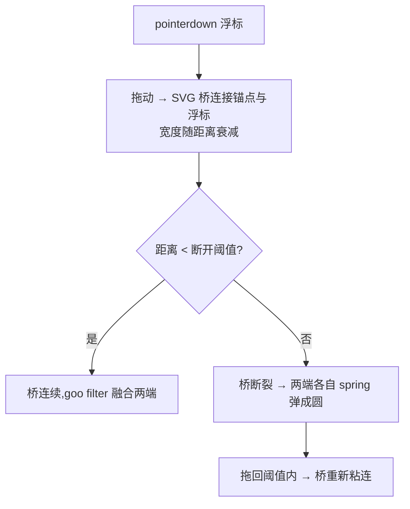

# Metaball Tether —— 液滴粘连拖拽骨架

> Framework 模板。拖动浮标时,浮标与原锚点之间拉出一条"液态桥":近则粗、远则细,超过断开阈值桥断裂,两端各自弹回圆形。SVG gooey filter + 贝塞尔桥实现。来源:UI 交互教学视频转录提取(2026-09,西瓜同学)。MOTION_INTENSITY 5-8 适用(见 [`dials.md`](../meta/dials.md))。

## 视觉效果



## HTML 结构

```svg
<svg id="tether" width="0" height="0">
  <defs>
    <filter id="goo">
      <feGaussianBlur in="SourceGraphic" stdDeviation="8" result="blur"/>
      <feColorMatrix in="blur" mode="matrix"
        values="1 0 0 0 0  0 1 0 0 0  0 0 1 0 0  0 0 0 20 -9" result="goo"/>
      <feComposite in="SourceGraphic" in2="goo" operator="atop"/>
    </filter>
  </defs>
  <g filter="url(#goo)">
    <circle id="anchor" r="14"/>
    <path id="bridge" fill="currentColor"/>
    <circle id="knob" r="14"/>
  </g>
</svg>
```

## 核心实现(SVG + rAF)

```js
const BREAK = 120, MAXW = 26;                    // 断开阈值(px) / 桥最大宽度
let broken = false;

function frame(mx, my, ax, ay) {
  const dx = mx - ax, dy = my - ay;
  const dist = Math.hypot(dx, dy);
  broken = dist > BREAK;
  if (broken) { bridge.setAttribute('d', ''); snapBack(); return; }
  const w = MAXW * (1 - dist / BREAK);           // 桥宽随距离衰减到 0
  const nx = -dy / (dist || 1), ny = dx / (dist || 1);   // 法线方向
  // 四点贝塞尔:锚点两侧 → 控制点在桥中段 → 浮标两侧
  bridge.setAttribute('d', [
    `M ${ax + nx * w / 2} ${ay + ny * w / 2}`,
    `Q ${(ax + mx) / 2} ${(ay + my) / 2} ${mx + nx * w / 2} ${my + ny * w / 2}`,
    `L ${mx - nx * w / 2} ${my - ny * w / 2}`,
    `Q ${(ax + mx) / 2} ${(ay + my) / 2} ${ax - nx * w / 2} ${ay - ny * w / 2} Z`,
  ].join(' '));
}
```

## 强制规则

- **必须**实现 `prefers-reduced-motion` 降级:无桥,浮标直接跟手(见 [`accessibility.md`](../meta/accessibility.md) 第 2 节)
- 桥宽必须随距离**连续衰减到 0** 后才断开;禁止近处突然消失(突变)
- 断开瞬间两端用 `ease-spring` 弹回圆形(过冲 ≤ 1.2),回入阈值内桥重新粘连(可逆)
- goo filter 的 `stdDeviation` 与 alpha 矩阵成对调参:blur 8 ↔ `0 0 0 20 -9`;改一个必须改另一个
- 桥只用于**单浮标 ↔ 单锚点**;多锚点各自独立桥,禁止桥间交叉
- 装饰性长动效 ≤ 600ms 且可跳过(见 [`micro-interactions.md`](../vocabulary/micro-interactions.md) 分层口径第 3 层)
- `touch-action: none` 于浮标,防止移动端滚动抢事件

## 失败模式

| 触发条件 | 处理 |
| --- | --- |
| 桥边缘毛糙/断层 | goo 参数不配对;blur 与 alpha 矩阵同步调 |
| 断开后不回弹 | snapBack 未触发或 tween 被 kill;断开分支必须建 spring tween |
| 性能差(移动端掉帧) | filter 区域过大;SVG 限定 viewBox 尺寸,避免全屏 filter |
| 拖回时不粘连 | broken 标志未复位;每帧重算,以当前帧距离为准 |
| 高分屏发虚 | feGaussianBlur 在低 dpi 采样;SVG 加 `shape-rendering: geometricPrecision` |
| 快速甩动桥甩尾滞后 | 桥点直接用 pointer 坐标即可,勿对坐标做缓存插值 |
