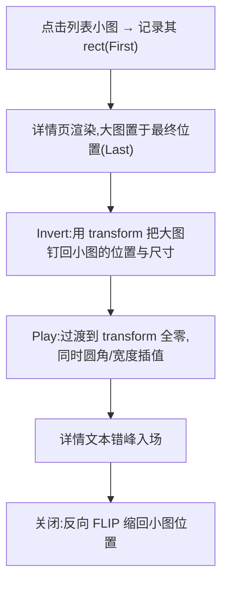

# Shared Element —— 共享元素转场骨架(FLIP)

> Framework 模板。列表小图原地放大成详情页大图(位置/尺寸/圆角连续过渡),关闭时原路缩回列表位。核心是 FLIP:First(记起点)-Last(记终点)-Invert(先钉在起点)-Play(过渡到终点)。来源:UI 交互教学视频转录提取(2026-09,叨叨AI/西瓜同学)。MOTION_INTENSITY 3-7 适用(见 [`dials.md`](../meta/dials.md))。

## 视觉效果



## HTML 结构

```html

<div class="detail" id="detail" hidden>
  
  <div class="detail-body">…</div>
</div>
```

## CSS

```css
.detail { position: fixed; inset: 0; background: var(--color-bg-primary); }
.hero { width: 100%; height: 50vh; object-fit: cover; border-radius: 0; }
.detail-entering .hero { will-change: transform; } /* 由 JS 动态设置,过渡后移除 */
```

## GSAP JavaScript

```js
import gsap from 'gsap';
import { Flip } from 'gsap/Flip';
gsap.registerPlugin(Flip);

const detail = document.getElementById('detail');
const hero = document.getElementById('hero');

document.getElementById('t1').addEventListener('click', (e) => {
  hero.src = e.target.dataset.full;
  detail.hidden = false;

  // FLIP:先记小图状态 → 让大图到达终点布局 → 从小图状态过渡过来
  const state = Flip.getState(hero);
  hero.classList.add('hero-final');           // 终态:占满 50vh、圆角 0
  Flip.from(state, {
    duration: 0.45,
    ease: 'power2.inOut',
    absolute: true,
    onComplete: () => { hero.style.willChange = 'auto'; },
  });
  // 详情文本错峰入场(内容不等图,图先行)
  gsap.from('.detail-body', { y: 24, opacity: 0, duration: 0.35, delay: 0.2,
    ease: 'cubic-bezier(0.23,1,0.32,1)' });
});

// 关闭:反向缩回缩略图位置(从终点布局过渡回 First)
document.getElementById('detail').addEventListener('close', () => {
  const state = Flip.getState(hero);
  hero.classList.remove('hero-final');
  Flip.from(state, { duration: 0.35, ease: 'power2.inOut', absolute: true,
    onComplete: () => { detail.hidden = true; } });
});
```

## 强制规则

- **必须**实现 `prefers-reduced-motion` 降级:直接切换页面,无 FLIP(见 [`accessibility.md`](../meta/accessibility.md) 第 2 节)
- **必须**过渡 `transform` 与 `border-radius`,不改 `width/height/top/left`(见 [`performance.md`](../meta/performance.md));用 Flip 插件 `absolute: true` 时由插件托管
- 大图**先钉在小图位置再下一帧放开**(Invert 必须在首帧绘制前完成),否则闪跳
- 详情页**内容错峰入场**(文本晚于图 150-250ms),共享元素只承载"同物"语义
- 返回导航(系统返回键/浏览器后退)必须同样走反向 FLIP,禁止只绑关闭按钮
- 过渡期间屏蔽对详情背景的点击(防中途误触)

## 失败模式

| 触发条件 | 处理 |
| --- | --- |
| 起跳瞬间闪跳 | Invert 未在首帧前应用;确认 `Flip.getState` 在布局变更**前**调用 |
| 图片比例失真 | 过渡中用 `object-fit: cover` + 固定容器,或过渡宽度时同步高度 |
| 滚动后返回位置错乱 | First 取的是点击时 rect,列表若已滚动需重取目标缩略图实时 rect |
| 竖向抖动 | 页面滚动容器与 fixed 详情坐标不一致;过渡期间锁 body 滚动 |
| reduced-motion 下闪黑 | 降级分支也要处理 `hidden` 切换时序,不能只 kill 动画 |
