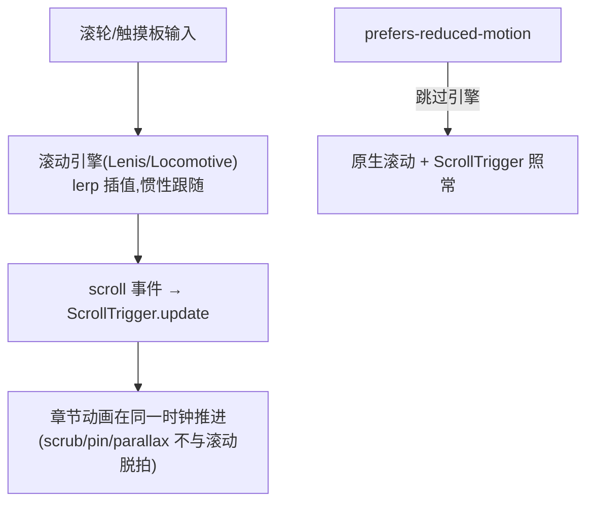

# Smooth Scroll —— 惯性平滑滚动引擎骨架

> Framework 模板。滚轮输入经 Lenis/Locomotive 插值为惯性跟随滚动,GSAP ScrollTrigger 挂在同一时钟上驱动章节动画。**适用范围仅 Web 营销/品牌站**(沉浸式滚动叙事);工具型/后台/表单密集页禁用(操作效率优先,原生滚动即预期),HarmonyOS/Flutter 无 DOM smooth-scroll 对应物,勿跨框架套用。来源:build-awwwards-quality-sites(cinematic gsap-lenis 思想吸收,中文自研),2026-09 吸收。MOTION_INTENSITY ≥ 7 适用(见 [`dials.md`](../meta/dials.md))。

## 视觉效果



## 适用判定(先判再用,引擎不是必选项)

maliang 既有两条滚动动画路径:GSAP ScrollTrigger(重,scrub/pin)与 IntersectionObserver(轻,见 [`scroll-reveal-stagger.md`](scroll-reveal-stagger.md) 双路径)。平滑滚动引擎是**第三层增强,不是强制引入**:

| 场景 | 用什么 |
| --- | --- |
| 单次揭示/轻交错 | IntersectionObserver,不引入引擎 |
| scrub/pin 少量场景 | ScrollTrigger 原生滚动即可,不引入引擎 |
| **整站滚动本身要被编排**(多章节滚动叙事、惯性跟手的沉浸式品牌站) | 本骨架:引擎 + ScrollTrigger 同时钟 |

## HTML 结构

```html
<!-- 引擎接管 window 滚动,无需额外容器;Lenis 推荐引入其 css 复位 -->
<body>
  <header class="site-header">…</header>
  <main>
    <section class="scene" data-scene="intro">…</section>
    <section class="scene" data-scene="story">…</section>
  </main>
</body>
```

## CSS(说明)

引擎接管 window 滚动,**无业务侧必需 CSS**;唯一要求是引入 Lenis 自带复位样式(在 JS 节 `import 'lenis/dist/lenis.css'`),用于在引擎启用时锁定滚动行为、避免原生滚动与插值叠加。若选 Locomotive,其 transform 驱动模式需把页面内容包进引擎指定容器,并自行处理 fixed/sticky 元素(见失败模式末行)。

## JS(以 Lenis + GSAP 为例)

```js
import Lenis from 'lenis';
import 'lenis/dist/lenis.css';
import gsap from 'gsap';
import { ScrollTrigger } from 'gsap/ScrollTrigger';
gsap.registerPlugin(ScrollTrigger);

// 唯一引擎铁律:Lenis 与 Locomotive 二选一,禁双装双初始化
let lenis = null;

const prefersReducedMotion = window.matchMedia('(prefers-reduced-motion: reduce)').matches;
if (!prefersReducedMotion) {
  lenis = new Lenis({
    lerp: 0.1,           // 插值系数 0.08-0.12:越小越"黏",越大越跟手;>0.15 失去惯性意义
    smoothWheel: true,   // 只接管滚轮;触摸设备保持原生滚动,禁 smoothTouch
    anchors: true,       // 锚点跳转(#id)交引擎接管,防失效
  });

  // 单一时钟:引擎 RAF 挂 gsap.ticker,禁另开 requestAnimationFrame 循环
  lenis.on('scroll', ScrollTrigger.update);
  gsap.ticker.add(rafDrive);
  gsap.ticker.lagSmoothing(0);
}

// ticker 回调提为具名函数,清理时 remove 需传同一引用
function rafDrive(time) { lenis?.raf(time * 1000); }

// 滚动场景编排(与 scroll-reveal-stagger 等骨架共用同一 ScrollTrigger 体系)
gsap.to('.scene[data-scene="story"] .card', {
  y: 0,
  opacity: 1,
  scrollTrigger: { trigger: '.scene[data-scene="story"]', start: 'top 80%' },
});

// 结构稳定后统一刷新:load(图片) + 字体 + 视口变更,都要 refresh
window.addEventListener('load', () => ScrollTrigger.refresh());
document.fonts?.ready.then(() => ScrollTrigger.refresh());

// SPA 路由离开时清理(强制)
function destroySmoothScroll() {
  gsap.ticker.remove(rafDrive);
  lenis?.destroy();
  lenis = null;
  ScrollTrigger.getAll().forEach((t) => t.kill());
}
```

## 强制规则

- **必须**先过「适用判定」:非营销/品牌叙事站不引入;单页少量动效不引入
- **必须**唯一引擎:Lenis 或 Locomotive **二选一**,禁双装、禁双初始化(两套 transform + 双 RAF 互相打架)
- **必须**单一时钟:引擎 RAF 挂 `gsap.ticker`,引擎 `scroll` 事件接 `ScrollTrigger.update`;禁独立 rAF 循环
- **必须** `prefers-reduced-motion: reduce` 时不初始化引擎——降级为原生滚动,ScrollTrigger 场景动画照常(内容不丢失,只去掉惯性)
- **必须**在 `window load`、`document.fonts.ready`、图片懒加载完成后、媒体查询变更后调 `ScrollTrigger.refresh()`,否则场景位置错位
- **必须**清理:SPA 路由卸载时 `lenis.destroy()` + `ScrollTrigger.getAll().kill()` + 移除 ticker 回调
- **必须**保留键盘与触屏滚动路径:只接管滚轮(`smoothWheel`),禁劫持 Tab 滚动/触摸原生滚动;锚点跳转经 `anchors` 选项或 `lenis.scrollTo()` 保证可达(焦点管理见 [`../meta/accessibility.md`](../meta/accessibility.md))
- `lerp` 0.08-0.12 起步;调参先回 [`dials.md`](../meta/dials.md) 校 MOTION_INTENSITY,不为「更丝滑」无限调黏
- 大面积 `position: fixed` 元素(导航/cookie 条)放引擎容器外,不参与插值

## 失败模式

| 触发条件 | 处理 |
| --- | --- |
| 页面滚动"打架"/跳动 | 检查是否双装(两引擎同时初始化)或引擎外另有 `overflow` 容器抢滚动 |
| 章节动画与滚动错拍 | 确认 `lenis.on('scroll', ScrollTrigger.update)` 已接、单一 ticker 时钟;晚加载内容后补 `refresh()` |
| 字体/图片加载后场景错位 | `document.fonts.ready` + `load` 后 `ScrollTrigger.refresh()`;懒加载图片声明宽高(见 [`../meta/performance.md`](../meta/performance.md) content-jumping 同源问题) |
| 锚点点击无反应 | 引擎未接管锚点:开 `anchors: true` 或改 `lenis.scrollTo(target)`;键盘焦点同步 `focus()` |
| reduced-motion 下仍有惯性 | 初始化前检查 matchMedia;已有实例则 `destroy()` 回原生 |
| SPA 路由切换后滚动失控 | 路由卸载钩子里 `destroy()` + kill 全部 ScrollTrigger,进入新页重新初始化并 refresh |
| Locomotive 下 sticky/fixed 失效 | Locomotive 以 transform 驱动容器,原生 sticky/fixed 会脱离视口——改选 Lenis(原生滚动 + wheel 插值)或用引擎自带 fixed 处理;这是二选一的关键差异 |
| 移动端滚动迟滞 | 关闭 smoothTouch 类选项,触摸保持原生;引擎收益仅限桌面滚轮 |
