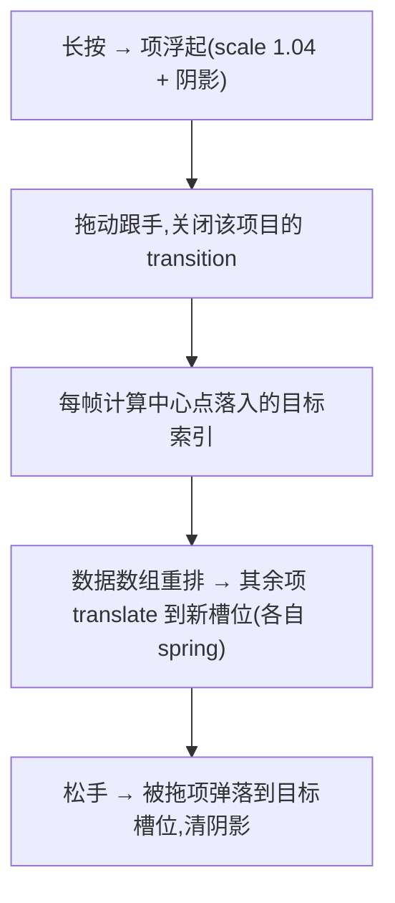

# Spring Reorder —— 拖拽排序弹簧让位骨架

> Framework 模板。长按拖起列表项后,落点索引逐帧重算,其余项各自以弹簧动画错峰让位到新槽位;松手落定。被拖项只跟手(无过渡),其余项才开过渡。来源:UI 交互教学视频转录提取(2026-09,叨叨AI/西瓜同学)。MOTION_INTENSITY 3-7 适用(见 [`dials.md`](../meta/dials.md))。

## 视觉效果



## HTML 结构

```html
<ul class="reorder-list" id="list">
  <li class="row" data-id="a">A</li>
  <li class="row" data-id="b">B</li>
  <li class="row" data-id="c">C</li>
  <li class="row" data-id="d">D</li>
</ul>
```

## CSS

```css
.reorder-list { position: relative; }
.row {
  height: 56px;                /* 固定行高是槽位计算前提,变高行需实测 rect */
  touch-action: none;
  /* 让位过渡只作用于"非被拖项";被拖项由 JS 加 .dragging 关闭过渡 */
  transition: transform 0.28s cubic-bezier(0.34, 1.56, 0.64, 1); /* ease-spring,过冲≤1.2 */
}
.row.dragging {
  transition: none;            /* 跟手,零过渡 */
  z-index: 1;
  box-shadow: 0 8px 24px rgba(0,0,0,.18);
  transform: scale(1.04);
}
```

## GSAP JavaScript

```js
import gsap from 'gsap';

const list = document.getElementById('list');
const rows = [...list.children];
const H = rows[0].offsetHeight;
let drag = null;
let order = rows.map((_, i) => i);          // order[槽位] = 元素下标

function slotOf(el) { return order.indexOf(rows.indexOf(el)); }

rows.forEach((row) => {
  row.addEventListener('pointerdown', (e) => {
    drag = { row, sy: e.clientY, oy: gsap.getProperty(row, 'y') };
    row.classList.add('dragging');
    row.setPointerCapture(e.pointerId);
  });
});

list.addEventListener('pointermove', (e) => {
  if (!drag) return;
  const dy = e.clientY - drag.sy;
  gsap.set(drag.row, { y: drag.oy + dy });               // 被拖项:直接跟手
  const center = drag.row.offsetTop + dy + H / 2;
  const target = Math.max(0, Math.min(rows.length - 1, Math.floor(center / H)));
  if (target !== slotOf(drag.row)) {                      // 落点索引变化才重排
    const from = slotOf(drag.row);
    order.splice(from, 1);
    order.splice(target, 0, rows.indexOf(drag.row));
    rows.forEach((r) => {                                 // 其余项:spring 让位
      if (r === drag.row) return;
      gsap.to(r, { y: (slotOf(r) - rows.indexOf(r)) * H,
        duration: 0.3, ease: 'back.out(1.2)', overwrite: 'auto' });
    });
  }
});

list.addEventListener('pointerup', () => {
  if (!drag) return;
  const { row } = drag;
  row.classList.remove('dragging');                       // 恢复过渡后落位
  gsap.to(row, { y: (slotOf(row) - rows.indexOf(row)) * H,
    duration: 0.3, ease: 'back.out(1.2)',
    onComplete: () => commitOrder() });
  drag = null;
});

function commitOrder() { /* 按 order 持久化排序;DOM 归零 translate */ }
```

## 强制规则

- **必须**实现 `prefers-reduced-motion` 降级:让位无动画直接换位(见 [`accessibility.md`](../meta/accessibility.md) 第 2 节)
- 被拖项 `transition: none` 纯跟手;**只改数据槽位**,让位项才开过渡(两端同时过渡是抖动根源)
- 让位统一用 `ease-spring`(过冲 ≤ 1.2,见 [`micro-interactions.md`](../vocabulary/micro-interactions.md) 缓动库),`overwrite: 'auto'` 防止叠加
- 行高一致用 `index * H` 计算;变高列表改为逐项实测 rect
- 松手落定后必须 `commitOrder` 归零 translate 并同步 DOM 顺序,二次拖拽前状态必须干净
- 触觉反馈:进入新槽位时 vibration ≤ 10ms(见 [`micro-interactions.md`](../vocabulary/micro-interactions.md) `micro-haptic`)

## 失败模式

| 触发条件 | 处理 |
| --- | --- |
| 列表抖动振荡 | 被拖项也开了过渡;确认 `.dragging { transition: none }` 生效 |
| 让位滞后一拍 | 落点索引只在越界时重算一次的写法漏帧;改为每帧计算+仅变化时重排 |
| 长列表错位 | 行高不一仍用 `index * H`;改用实测 offsetTop |
| 快速甩动丢让位 | 让位 tween 未 `overwrite`,多个 tween 叠加;加 `overwrite: 'auto'` |
| 移动端拖不动页面反而滚了 | 行缺 `touch-action: none` |
| 松手后二次拖拽从旧位置起 | 未归零 translate 就重排 DOM;落定回调里 commit 并清 transform |
